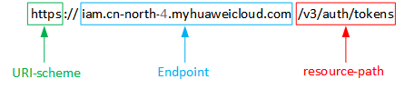

# 构造请求<a name="swr_02_0003"></a>

本节介绍如何构造REST API的请求，并以调用IAM服务的[获取用户Token](https://support.huaweicloud.com/api-iam/iam_30_0001.html)说明如何调用API，该API获取用户的Token，Token可以用于调用其他API时鉴权。

## 请求URI<a name="zh-cn_topic_0091607286_section1849899574"></a>

请求URI由如下部分组成。

**\{URI-scheme\} :// \{**Endpoint**\} / \{resource-path\} ? \{query-string\}**

尽管请求URI包含在请求消息头中，但大多数语言或框架都要求您从请求消息中单独传递它，所以在此单独强调。

-   **URI-scheme**：

    表示用于传输请求的协议，当前所有API均采用**HTTPS**协议。

-   **Endpoint**：

    指定承载REST服务端点的服务器域名或IP，不同服务不同区域的Endpoint不同，您可以从管理员处[地区和终端节点](https://developer.huaweicloud.com/dev/endpoint)获取。

    例如IAM服务在“华北-北京一“区域的Endpoint为“iam.cn-north-1.myhuaweicloud.com“。

-   **resource-path**：

    资源路径，也即API访问路径。从具体API的URI模块获取，例如“获取用户Token“API的resource-path为“/v3/auth/tokens“。

-   **query-string**：

    查询参数，是可选部分，并不是每个API都有查询参数。查询参数前面需要带一个“？“，形式为“参数名=参数取值“，例如“limit=10“，表示查询不超过10条数据。


例如您需要获取IAM在“华北-北京一“区域的Token，则需使用“华北-北京一“区域的Endpoint（iam.cn-north-1.myhuaweicloud.com），并在[获取用户Token](https://support.huaweicloud.com/api-iam/iam_30_0001.html)的URI部分找到resource-path（/v3/auth/tokens），拼接起来如下所示。

```
https://iam.cn-north-1.myhuaweicloud.com/v3/auth/tokens
```

**图 1**  URI示意图<a name="zh-cn_topic_0091607286_fig949762553218"></a>  


> **说明：** 
>为查看方便，在每个具体API的URI部分，只给出resource-path部分，并将请求方法写在一起。这是因为URI-scheme都是HTTPS，同一个服务的Endpoint在同一个区域也相同，所以简洁起见将这两部分省略。

## 请求方法<a name="zh-cn_topic_0091607286_section580035055419"></a>

HTTP请求方法（也称为操作或动词），它告诉服务你正在请求什么类型的操作。

-   **GET**：请求服务器返回指定资源。
-   **PUT**：请求服务器更新指定资源。
-   **POST**：请求服务器新增资源或执行特殊操作。
-   **DELETE**：请求服务器删除指定资源，如删除对象等。
-   **HEAD**：请求服务器资源头部。
-   **PATCH**：请求服务器更新资源的部分内容。当资源不存在的时候，PATCH可能会去创建一个新的资源。

在[获取用户Token](https://support.huaweicloud.com/api-iam/iam_30_0001.html)的URI部分，您可以看到其请求方法为“POST“，则其请求为：

```
POST https://iam.cn-north-1.myhuaweicloud.com/v3/auth/tokens
```

## 请求消息头<a name="zh-cn_topic_0091607286_section1454211155819"></a>

附加请求头字段，如指定的URI和HTTP方法所要求的字段。例如定义消息体类型的请求头“Content-Type“，请求鉴权信息等。

如下公共消息头需要添加到请求中。

-   **Content-Type**：消息体的类型（格式），必选，默认取值为“application/json“，有其他取值时会在具体接口中专门说明。
-   **X-Auth-Token**：用户Token，可选，当使用Token方式认证时，必须填充该字段。用户Token也就是调用[获取用户Token](https://support.huaweicloud.com/api-iam/iam_30_0001.html)接口的响应值，该接口是唯一不需要认证的接口。

    > **说明：** 
    >API同时支持使用AK/SK认证，AK/SK认证是使用SDK对请求进行签名，签名过程会自动往请求中添加Authorization（签名认证信息）和X-Sdk-Date（请求发送的时间）请求头。
    >AK/SK认证的详细说明请参见[AK/SK认证](认证鉴权.md#zh-cn_topic_0091607401_section5887143815518)。


对于[获取用户Token](https://support.huaweicloud.com/api-iam/iam_30_0001.html)接口，由于不需要认证，所以只添加“Content-Type“即可，添加消息头后的请求如下所示。

```
POST https://iam.cn-north-1.myhuaweicloud.com/v3/auth/tokens
Content-Type: application/json
```

## 请求消息体<a name="zh-cn_topic_0091607286_section14612192315587"></a>

请求消息体通常以结构化格式发出，与请求消息头中Content-type对应，传递除请求消息头之外的内容。若请求消息体中参数支持中文，则中文字符必须为UTF-8编码。

每个接口的请求消息体内容不同，也并不是每个接口都需要有请求消息体（或者说消息体为空），GET、DELETE操作类型的接口就不需要消息体，消息体具体内容需要根据具体接口而定。

对于[获取用户Token](https://support.huaweicloud.com/api-iam/iam_30_0001.html)接口，您可以从接口的请求部分看到所需的请求参数及参数说明。将消息体加入后的请求如下所示，加粗的斜体字段需要根据实际值填写，其中_**username**_为用户名，_**domainname**_为用户所属的账号名称，**_\*\*\*\*\*\*\*\*_**为用户登录密码，**_xxxxxxxxxxxxxxxxxx_**为project的名称，如“cn-north-1”，您可以从管理员处[地区和终端节点](https://developer.huaweicloud.com/dev/endpoint)获取，对应地区和终端节点页面的“区域”字段的值。

> **说明：** 
>scope参数定义了Token的作用域，下面示例中获取的Token仅能访问project下的资源。您还可以设置Token作用域为某个账号下所有资源或账号的某个project下的资源，详细定义请参见[获取用户Token](https://support.huaweicloud.com/api-iam/iam_30_0001.html)。

```
POST https://iam.cn-north-1.myhuaweicloud.com/v3/auth/tokens
Content-Type: application/json

{
    "auth": {
        "identity": {
            "methods": [
                "password"
            ],
            "password": {
                "user": {
                    "name": "username",
                    "password": "********",
                    "domain": {
                        "name": "domainname"
                    }
                }
            }
        },
        "scope": {
            "project": {
                "name": "xxxxxxxxxxxxxxxxxx"
            }
        }
    }
}
```

到这里为止这个请求需要的内容就具备齐全了，您可以使用[curl](https://curl.haxx.se/)、[Postman](https://www.getpostman.com/)或直接编写代码等方式发送请求调用API。对于获取用户Token接口，返回的响应消息头中“x-subject-token”就是需要获取的用户Token。有了Token之后，您就可以使用Token认证调用其他API。

