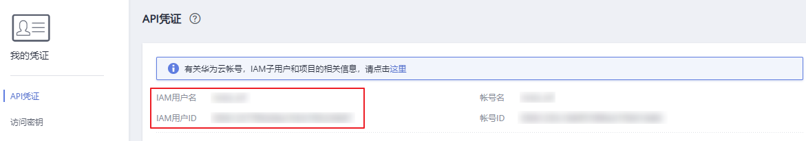

# 获取用户名和用户ID

## 操作场景

在调用接口的时候，部分URL中需要填入用户名和用户ID，所以需要先在管理控制台上获取。具体方法见[操作步骤](#section7150194516319)。

## 操作步骤

1.  登录管理控制台。
2.  鼠标悬停在右上角的用户名，选择下拉列表中的“我的凭证”。

    在“API凭证”页面查看IAM用户名和IAM用户ID。

    **图 1**  API凭证  
    

