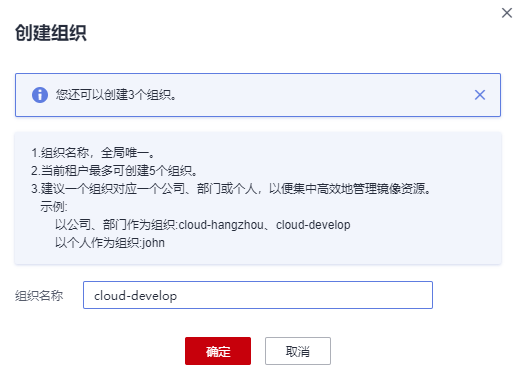

# 上传镜像至容器镜像服务<a name="swr_01_0009"></a>

本文以一个2048应用为例，讲述根据该应用编写Dockerfile文件构建镜像并上传至容器镜像服务的操作。您可以编写一个Dockerfile文件，以alpine:3.7为基础镜像，来构建一个2048容器镜像。

## 前提条件<a name="section0201103753314"></a>

-   已安装Docker，如未安装可参见[安装Docker](安装Docker.md)。
-   已获取2048应用，并将该镜像下载至本地。

## 构建镜像<a name="section19928101913611"></a>

1.  登录虚拟机。
2.  创建**2048-demo**目录。

    mkdir 2048-demo

3.  下载2048源码至myAlpine目录中。

    该应用源码地址为：[https://github.com/gabrielecirulli/2048.git](https://github.com/gabrielecirulli/2048.git)。

4.  创建名为Dockerfile的文件。

    cd myApline

    touch Dockerfile

5.  编辑Dockerfile。

    vi Dockerfile

    ```
    FROM alpine:3.7  
    RUN apk --update add nginx  
    COPY 2048 /usr/share/nginx/html  
    EXPOSE 80 
    CMD ["nginx", "-g", "daemon off;"]
    ```

    -   FROM：指定基础镜像alpine:3.7。
    -   RUN：安装nginx。
    -   COPY：将2048源码拷贝到容器内的“/usr/share/nginx/html”目录。
    -   EXPOSE：暴露容器的80端口。
    -   CMD：指定容器运行时的默认命令。

    保存并退出。

6.  执行以下命令构建镜像。

    docker build -t 2048-demo:v1 .

    镜像构建的格式为：docker build \[选项\] <上下文路径\>，详细命令可参考[https://docs.docker.com/engine/reference/commandline/build/](https://docs.docker.com/engine/reference/commandline/build/)。

    -   -t 2048-demo:v1：指定镜像的名称和版本。
    -   **.**：指定Dockerfile所在目录，镜像构建命令会按照Dockerfile的内容构建镜像。

7.  执行以下命令，可查看到已成功构建的**2048-demo**镜像，版本为v1。

    docker images | grep 2048-demo

    **图 1**  查看已构建的2048-demo镜像<a name="fig1966105120365"></a>  
    


## 创建组织<a name="section89499612716"></a>

组织用于隔离镜像，并为租户下用户指定不同的权限（读取、编辑、管理）。

-   读取：只能下载镜像，不能上传。
-   编辑：下载镜像、上传镜像、编辑镜像属性以及创建触发器。
-   管理：下载镜像、上传镜像、删除镜像或版本、编辑镜像属性、添加授权、添加触发器以及共享镜像。

1.  登录容器镜像服务控制台。
2.  在左侧菜单栏选择“组织管理“，单击右侧“创建组织“，在弹出的页面中填写“组织名称“，然后单击“确定“。

    **图 2**  创建组织<a name="fig166614126427"></a>  
    


## 客户端上传镜像<a name="section19309852185217"></a>

docker客户端上传镜像，是指使用docker命令将镜像上传到容器镜像服务的镜像仓库。

本章节以**2048-demo:v1**镜像为例，介绍如何上传镜像。上传成功后，在“我的镜像“中显示已上传成功的镜像。

> **注意：**   
>-   使用客户端上传镜像，镜像的每个layer大小不能超过10G。  
>-   上传镜像的Docker客户端版本必须为1.11.2及以上。  

1.  连接容器镜像服务。
    1.  登录容器镜像服务控制台。
    2.  在左侧菜单栏选择“我的镜像“，单击右侧“客户端上传“，在弹出的页面中单击“生成临时的docker login指令“，单击复制docker login指令。docker login指令末尾的域名即为当前镜像仓库地址，记录该地址。

        **图 3**  获取docker login指令<a name="fig13751239104219"></a>  
        

        > **说明：**   
        >此处获取的docker login指令有效期为16小时，若需要长期有效的docker login指令，请参见[获取长期有效docker login指令](获取长期有效docker-login指令.md)。  

    3.  在安装Docker的机器中执行上一步复制的docker login指令。

        登录成功会显示“login succeeded“。


2.  在安装docker的机器给**2048-demo:v1**镜像打标签。

    docker tag \[镜像名:版本号\] \[镜像仓库地址\]/\[组织名称\]/\[镜像名:版本号\]

    样例如下：

    docker tag 2048-demo:v1 swr.cn-north-1.myhuaweicloud.com/group/2048-demo:v1

    其中：

    -   swr.cn-north-1.myhuaweicloud.com为容器镜像服务的镜像仓库地址。
    -   group为组织名称，如果该组织还没有创建，容器镜像服务会根据组织名称自动创建一个组织。
    -   2048-demo:v1 为镜像名称和版本号。

3.  上传镜像至镜像仓库。

    docker push \[镜像仓库地址\]/\[组织名称\]/\[镜像名:版本号\]

    样例如下：

    docker push swr.cn-north-1.myhuaweicloud.com/group/2048-demo:v1

    终端显示如下信息，表明push镜像成功。

    ```
    6d6b9812c8ae: Pushed 
    695da0025de6: Pushed 
    fe4c16cbf7a4: Pushed 
    v1: digest: sha256:eb7e3bbd8e3040efa71d9c2cacfa12a8e39c6b2ccd15eac12bdc49e0b66cee63 size: 948
    ```

    返回系统，在“我的镜像“页面，执行刷新操作后可查看到对应的镜像信息。


