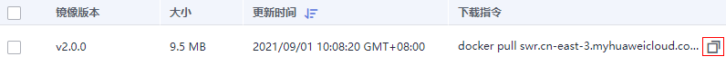
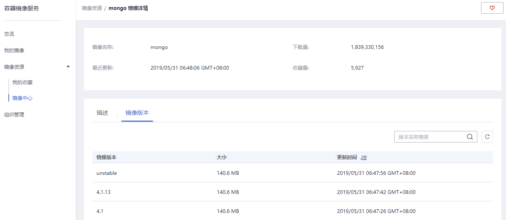

# 下载镜像<a name="swr_01_0017"></a>

## 操作场景<a name="section165112517497"></a>

您可以使用docker pull命令下载容器镜像服务中的镜像。

## 前提条件<a name="section12536114414324"></a>

-   在下载镜像前，请确保您的网络畅通。详细网络配置步骤请参考[配置访问网络](https://support.huaweicloud.com/bestpractice-swr/swr_bestpractice_0013.html)。
-   在下载镜像前，请联系管理员在IAM控制台授权容器镜像服务下载权限，详情请参考[权限管理](https://support.huaweicloud.com/productdesc-swr/swr_03_0005.html)。
-   “我的镜像”展示当前用户所有的自有镜像（该用户所在组织所拥有的镜像）和共享镜像（该组织下其他用户共享的私有镜像）。
-   IAM用户创建后，需要管理员在组织中为您添加授权，您才具有该组织内镜像的读取、编辑等权限。详情请参考[授权管理](授权管理.md)

## 下载“我的镜像”<a name="section13356144645616"></a>

1.  以root用户登录容器引擎所在的虚拟机。
2.  参考[2](客户端上传镜像.md#zh-cn_topic_0112596104_zh-cn_topic_0075378957_li58001655123)获取登录访问权限，连接容器镜像服务。
3.  登录容器镜像服务控制台。
4.  在左侧导航栏选择“我的镜像“，单击右侧镜像名称。
5.  <a name="zh-cn_topic_0084266454_li197783469319"></a>在镜像详情页面中，单击对应镜像版本“下载指令“列的复制图标，复制镜像下载指令。

    **图 1**  获取镜像下载指令<a name="zh-cn_topic_0084266454_fig18518532151513"></a>  
    

6.  在虚拟机中执行[5](#zh-cn_topic_0084266454_li197783469319)复制的镜像下载指令。

    示例：**docker pull swr.cn-east-3.myhuaweicloud.com/group/nginx:v2.0.0**

    使用**docker images**命令查看是否下载成功。

    ```
    # docker images
    REPOSITORY                                                              TAG       IMAGE ID       CREATED         SIZE
    swr.cn-east-3.myhuaweicloud.com/group/nginx                             v2.0.0    22f2bf2e2b4f   5 hours ago     22.8MB
    ```

7.  （可选）执行如下命令将镜像保存为归档文件。

    **docker save**  \[镜像名称:版本名称\]  **\>**  \[归档文件名称\]

    示例：**docker save swr.cn-east-3.myhuaweicloud.com/group/nginx:v2.0.0 \> nginx.tar**


## 下载镜像中心的镜像<a name="section89579182913"></a>

镜像中心的镜像可直接下载，无需添加仓库地址。如[图2](#fig2889193517333)所示的mongo镜像，只需容器引擎所在虚拟机连接SWR，且执行如下命令即可将其下载。

**docker pull mongo:**_4.1_

**图 2**  mongo镜像详情<a name="fig2889193517333"></a>  


详细镜像下载步骤，请参考[下载“我的镜像”](下载镜像.md)。

