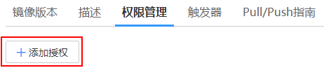
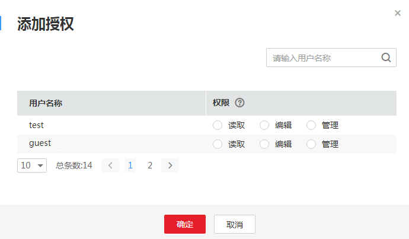

# 为用户添加授权

添加用户授权，授权完成后，该租户下用户享有读取/编辑/管理该镜像的权限。

-   读取：只能下载镜像，不能上传。
-   编辑：下载镜像、上传镜像、编辑镜像属性以及创建触发器。
-   管理：下载镜像、上传镜像、删除镜像或版本、编辑镜像属性、添加授权、添加触发器以及共享镜像。

1.  登录容器镜像服务控制台。
2.  在左侧菜单栏选择“我的镜像“，单击右侧要编辑镜像的名称。
3.  在镜像详情页面选择“权限管理“页签。

    **图 1**  授权管理  
    

4.  单击“添加授权“，选择租户下用户名称，添加“读取/编辑/管理“的权限，添加后，该用户享有对应权限。

    **图 2**  添加授权  
    

5.  您还可以修改该用户权限及删除该用户权限。

