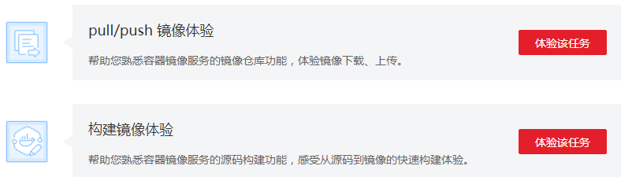
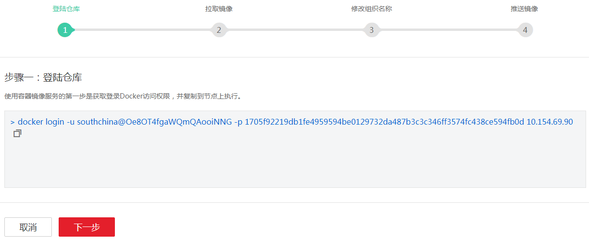
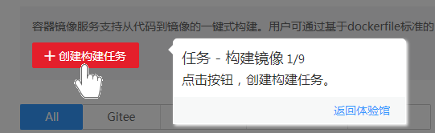

# 体验馆

为客户提供容器镜像服务的关键特性引导，给予客户完美的实践体验。

1.  登录容器镜像服务控制台。
2.  在左侧菜单栏选择“体验馆”，页面上提供了两种体验，如[图1](#fig1522315132714)所示。

    **图 1**  体验  
    

    **表 1**  体验

    
    <table><thead align="left"><tr id="row1893664562814"><th class="cellrowborder" valign="top" width="25.180000000000003%" id="mcps1.2.3.1.1">
体验

    </th>
    <th class="cellrowborder" valign="top" width="74.82%" id="mcps1.2.3.1.2">
说明

    </th>
    </tr>
    </thead>
    <tbody><tr id="row8936184522816"><td class="cellrowborder" valign="top" width="25.180000000000003%" headers="mcps1.2.3.1.1 ">
pull/push 镜像体验

    </td>
    <td class="cellrowborder" valign="top" width="74.82%" headers="mcps1.2.3.1.2 ">
帮助您熟悉容器镜像服务的镜像仓库功能，体验镜像下载、上传。

    </td>
    </tr>
    <tr id="row10936745152811"><td class="cellrowborder" valign="top" width="25.180000000000003%" headers="mcps1.2.3.1.1 ">
构建镜像体验

    </td>
    <td class="cellrowborder" valign="top" width="74.82%" headers="mcps1.2.3.1.2 ">
帮助您熟悉容器镜像服务的源码构建功能，感受从源码到镜像的快速构建体验。

    </td>
    </tr>
    </tbody>
    </table>

3.  pull/push 镜像体验。
    1.  选择“pull/push 镜像体验”后的“体验该任务”。
    2.  根据界面提示，逐步完成体验，如[图2](#fig452892942813)所示。

        **图 2**  pull/push 镜像体验  
        

4.  构建镜像体验。
    1.  选择“构建镜像体验”后的“体验该任务”。
    2.  根据界面提示，完成镜像构建，如[图3](#fig556510101298)所示。

        **图 3**  构建镜像体验  
        

