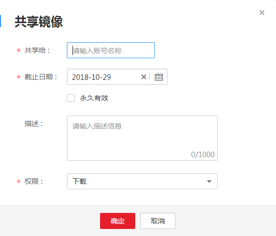

# 共享私有镜像

镜像上传后，您可以共享私有镜像给其他账号，并授予下载该镜像的权限。被共享的用户需要登录容器镜像服务控制台，在“我的镜像 \> 他人共享“页面查看共享的镜像。被共享的用户单击镜像名称，可进入镜像详情页面查看镜像版本、下载指令等。

## 使用约束

-   仅账号和具备该私有镜像管理权限IAM用户才能共享镜像，被共享者只有只读权限，只能下载镜像。
-   镜像共享功能只能在同一区域内使用，不支持在不同区域间镜像共享。

## 操作步骤

1.  登录容器镜像服务控制台。
2.  在左侧菜单栏选择“我的镜像“，单击右侧要编辑镜像的名称。
3.  在镜像详情页面选择“共享“页签。
4.  单击“共享镜像“，在提示框中输入共享的账号，共享截止日期，选择共享权限，然后单击“确定“。

    **图 1**  共享镜像  
    

    **表 1**  共享镜像

    
    <table><thead align="left"><tr id="row362424415719"><th class="cellrowborder" valign="top" width="16%" id="mcps1.2.3.1.1">
参数

    </th>
    <th class="cellrowborder" valign="top" width="84%" id="mcps1.2.3.1.2">
说明

    </th>
    </tr>
    </thead>
    <tbody><tr id="row126241344125712"><td class="cellrowborder" valign="top" width="16%" headers="mcps1.2.3.1.1 ">
共享给

    </td>
    <td class="cellrowborder" valign="top" width="84%" headers="mcps1.2.3.1.2 ">
输入账号名称。

    </td>
    </tr>
    <tr id="row1462434455710"><td class="cellrowborder" valign="top" width="16%" headers="mcps1.2.3.1.1 ">
截止日期

    </td>
    <td class="cellrowborder" valign="top" width="84%" headers="mcps1.2.3.1.2 ">
选择共享截止日期。如勾选“永久有效”，则共享永久有效。

    </td>
    </tr>
    <tr id="row1362494415711"><td class="cellrowborder" valign="top" width="16%" headers="mcps1.2.3.1.1 ">
描述

    </td>
    <td class="cellrowborder" valign="top" width="84%" headers="mcps1.2.3.1.2 ">
输入描述，0-1000个字符。

    </td>
    </tr>
    <tr id="row2034315951713"><td class="cellrowborder" valign="top" width="16%" headers="mcps1.2.3.1.1 ">
权限

    </td>
    <td class="cellrowborder" valign="top" width="84%" headers="mcps1.2.3.1.2 ">
当前仅支持“下载”权限。

    </td>
    </tr>
    </tbody>
    </table>

5.  共享完成后，您可以在“我的镜像 \> 自有镜像“中，勾选“我共享的镜像“，查看所有共享的镜像。

