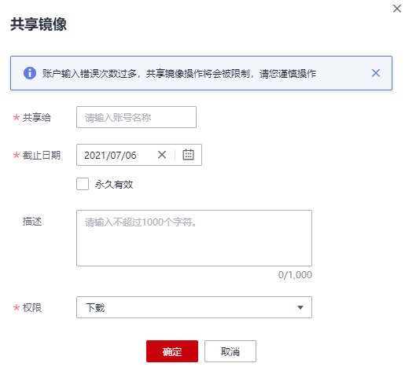

# 共享私有镜像

镜像上传后，您可以共享私有镜像给其他租户，并授予用户操作该镜像的权限。

## 前提条件

仅租户和具备该私有镜像管理权限用户才能共享镜像，被共享者只有只读权限，只能下载镜像。

## 操作步骤

1.  登录容器镜像服务控制台。
2.  在左侧菜单栏选择“我的镜像“，单击右侧要编辑镜像的名称。
3.  在镜像详情页面选择“共享“页签。
4.  单击“共享镜像“，在提示框中输入共享的账号，共享截止日期，选择共享权限，然后单击“确定“。

    **图 1**  共享镜像  
    

5.  共享完成后，您可以在“我的镜像“中，勾选“我共享的镜像“，查看所有共享的镜像。

    **图 2**  查看共享镜像  
    

6.  被共享的用户可登录容器镜像服务控制台，并在“我的镜像\>他人共享“页面查看到该镜像信息。

