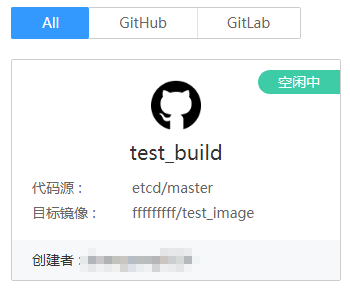
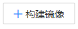
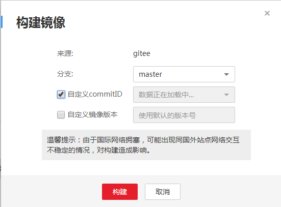

# 创建构建任务

绑定源码仓库账号后，您需要创建构建任务，从源码托管网站下载代码来自动构建镜像。

## 前提条件

源代码中必须有Dockerfile文件才能构建成功。

## 操作步骤

1.  登录容器镜像服务控制台。
2.  在左侧菜单栏选择“镜像构建 \> 构建任务“，单击“创建构建任务“。
3.  填写构建任务参数，参说明请参见[表1](#table386395520144)。

    **表 1**  参数说明

    
    <table><thead align="left"><tr id="row386455515143"><th class="cellrowborder" valign="top" width="20%" id="mcps1.2.3.1.1">
参数

    </th>
    <th class="cellrowborder" valign="top" width="80%" id="mcps1.2.3.1.2">
说明

    </th>
    </tr>
    </thead>
    <tbody><tr id="row886425511411"><td class="cellrowborder" valign="top" width="20%" headers="mcps1.2.3.1.1 ">
*任务名称

    </td>
    <td class="cellrowborder" valign="top" width="80%" headers="mcps1.2.3.1.2 ">
构建任务的名称。

    </td>
    </tr>
    <tr id="row1686485512147"><td class="cellrowborder" valign="top" width="20%" headers="mcps1.2.3.1.1 ">
描述

    </td>
    <td class="cellrowborder" valign="top" width="80%" headers="mcps1.2.3.1.2 ">
构建任务的描述，支持Markdown格式。

    </td>
    </tr>
    <tr id="row48651255101418"><td class="cellrowborder" valign="top" width="20%" headers="mcps1.2.3.1.1 ">
*代码源

    </td>
    <td class="cellrowborder" valign="top" width="80%" headers="mcps1.2.3.1.2 ">
代码源，选择代码仓库。

    
如果未绑定源码托管网站的账号，请单击“绑定账号”，具体步骤请参见<a href="绑定源码仓库账号.md">绑定源码仓库账号</a>。

    </td>
    </tr>
    <tr id="row6802244392"><td class="cellrowborder" valign="top" width="20%" headers="mcps1.2.3.1.1 ">
*构建设置

    </td>
    <td class="cellrowborder" valign="top" width="80%" headers="mcps1.2.3.1.2 "><ul id="ul977711411468"><li>代码分支：选择使用哪个代码分支。</li><li>Dockerfile目录：此处填写Dockerfile文件在源代码中的路径。<ul id="ul58441038410"><li>如果Dockerfile文件在根目录下，文件名称为Dockerfile，此处填写“/Dockerfile”。</li></ul>
    </li><li>自定义构建路径：构建工程目录，由用户自定义。该目录或其子目录必须包含Dockerfile文件。<ul id="ul16439711249"><li>如果Dockerfile文件在根目录下，此处可不填。</li><li>如果Dockerfile文件在“/src/a”目录下，文件名称为Dockerfile，则Dockerfile目录填写“/src/a/Dockerfile”，自定义构建路径可为“/”或“/src”或“/src/a”。</li></ul>
    </li></ul>
    </td>
    </tr>
    <tr id="row856019166336"><td class="cellrowborder" valign="top" width="20%" headers="mcps1.2.3.1.1 ">
构建缓存

    </td>
    <td class="cellrowborder" valign="top" width="80%" headers="mcps1.2.3.1.2 ">
若勾选“缓存构建信息”，可以对构建信息进行缓存，提升下次构建速度。

    </td>
    </tr>
    <tr id="row116007477171"><td class="cellrowborder" valign="top" width="20%" headers="mcps1.2.3.1.1 ">
*组织

    </td>
    <td class="cellrowborder" valign="top" width="80%" headers="mcps1.2.3.1.2 ">
构建输出的镜像所在的组织。

    </td>
    </tr>
    <tr id="row15538486171"><td class="cellrowborder" valign="top" width="20%" headers="mcps1.2.3.1.1 ">
*镜像名称

    </td>
    <td class="cellrowborder" valign="top" width="80%" headers="mcps1.2.3.1.2 ">
镜像名称。

    
小写字母或数字开头，后面跟小写字母、数字、下划线或中划线（其中下划线最多允许连续两个，并且不能直接与中划线相连），小写字母或数字结尾，1-128个字符。

    </td>
    </tr>
    <tr id="row1522584831715"><td class="cellrowborder" valign="top" width="20%" headers="mcps1.2.3.1.1 ">
*镜像版本前缀

    </td>
    <td class="cellrowborder" valign="top" width="80%" headers="mcps1.2.3.1.2 ">
镜像版本前缀，例如前缀设置为”version“，则构建成功的镜像版本号为”version.n“，n为构建成功的次数，从”1“开始，每构建成功一次自动加一。

    
大小写字母、数字或下划线开头，后面跟大小写字母、数字以及点、中划线、下划线，1-16个字符。

    </td>
    </tr>
    </tbody>
    </table>

4.  单击“创建“。

    创建成功后会在构建任务页面显示，如下图所示。

    **图 1**  创建  
    

5.  构建镜像单击创建的构建任务，进入详情，单击右上角，选择“自定义Commit ID“，单击“构建“。

    **图 2**  创建构建任务  
    

    构建任务开始后，在详情页下方“构建历史“tab页显示详细的构建信息。

    镜像构建成功后，在“我的镜像“中可以查看到构建的镜像。

