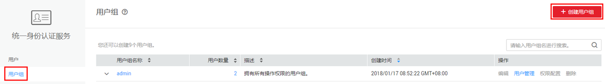
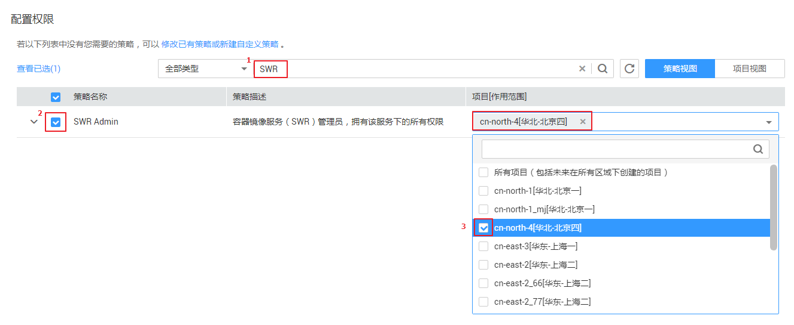
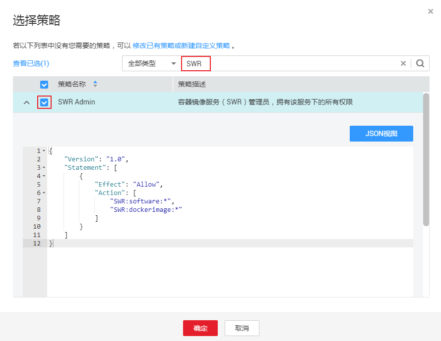
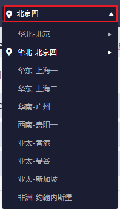

# 创建用户并授权使用SWR

本章节通过简单的用户组授权方法，将SWR的策略授予用户组，并将用户添加至用户组中，从而使用户拥有对应的SWR权限，操作流程如[图1](#fig673713328586)所示。

**图 1**  给用户授权SWR权限流程  

1.  创建用户组并授权

    在IAM控制台创建用户组，并授予容器镜像服务的管理员权限“SWR Admin”。

2.  创建用户

    在IAM控制台创建用户，并将其加入[1](#li8135822590)中创建的用户组。

3.  用户登录并验证权限

    新创建的用户登录控制台，验证容器镜像服务的管理员权限。

## 背景信息

给用户组授权之前，请您了解用户组可以添加的SWR系统策略，如[表1](#table7716440270)所示。若您需要对除SWR之外的其它服务授权，IAM支持服务的所有策略请参见[权限策略](https://support.huaweicloud.com/usermanual-permissions/zh-cn_topic_0063498930.html)。

**表 1**  SWR系统策略

<table><thead align="left"><tr id="zh-cn_topic_0169936648_row1346222921318"><th class="cellrowborder" valign="top" width="20.437956204379564%" id="mcps1.2.4.1.1">
策略名称

</th>
<th class="cellrowborder" valign="top" width="56.4043595640436%" id="mcps1.2.4.1.2">
描述

</th>
<th class="cellrowborder" valign="top" width="23.15768423157684%" id="mcps1.2.4.1.3">
策略类别

</th>
</tr>
</thead>
<tbody><tr id="zh-cn_topic_0169936648_row1462142915137"><td class="cellrowborder" valign="top" width="20.437956204379564%" headers="mcps1.2.4.1.1 ">
SWR Admin

</td>
<td class="cellrowborder" valign="top" width="56.4043595640436%" headers="mcps1.2.4.1.2 ">
容器镜像服务的管理员权限，拥有该服务下的所有权限。

</td>
<td class="cellrowborder" valign="top" width="23.15768423157684%" headers="mcps1.2.4.1.3 ">
RBAC策略

</td>
</tr>
<tr id="zh-cn_topic_0169936648_row112721016495"><td class="cellrowborder" valign="top" width="20.437956204379564%" headers="mcps1.2.4.1.1 ">
Tenant Administrator

</td>
<td class="cellrowborder" valign="top" width="56.4043595640436%" headers="mcps1.2.4.1.2 ">
容器镜像服务的管理员权限，拥有该服务下的所有权限。

</td>
<td class="cellrowborder" valign="top" width="23.15768423157684%" headers="mcps1.2.4.1.3 ">
细粒度策略

</td>
</tr>
<tr id="zh-cn_topic_0169936648_row157318307917"><td class="cellrowborder" valign="top" width="20.437956204379564%" headers="mcps1.2.4.1.1 ">
Tenant Guest

</td>
<td class="cellrowborder" valign="top" width="56.4043595640436%" headers="mcps1.2.4.1.2 ">
容器镜像服务的开发者权限，拥有下载镜像等权限。

<ul id="zh-cn_topic_0169936648_ul1739515885811"><li>在容器镜像服务中进行<a href="https://support.huaweicloud.com/usermanual-swr/swr_01_0015.html" target="_blank" rel="noopener noreferrer">授权管理</a>，可以添加对某个镜像或组织中所有镜像的读取、编辑或管理权限。</li></ul>
</td>
<td class="cellrowborder" valign="top" width="23.15768423157684%" headers="mcps1.2.4.1.3 ">
细粒度策略

</td>
</tr>
<tr id="zh-cn_topic_0169936648_row19269191915109"><td class="cellrowborder" valign="top" width="20.437956204379564%" headers="mcps1.2.4.1.1 ">
SvcStg Developer

</td>
<td class="cellrowborder" valign="top" width="56.4043595640436%" headers="mcps1.2.4.1.2 ">
容器镜像服务的开发者权限，拥有下载镜像等权限。

<ul id="zh-cn_topic_0169936648_ul65401350335"><li>在容器镜像服务中进行<a href="https://support.huaweicloud.com/usermanual-swr/swr_01_0015.html" target="_blank" rel="noopener noreferrer">授权管理</a>，可以添加对某个镜像或组织中所有镜像的读取、编辑或管理权限。</li></ul>
</td>
<td class="cellrowborder" valign="top" width="23.15768423157684%" headers="mcps1.2.4.1.3 ">
RBAC策略

</td>
</tr>
</tbody>
</table>

## 步骤1：创建用户组并授权

用户组是用户的集合，IAM通过用户组功能实现用户的授权。您在IAM中创建的用户，需要加入特定用户组后，用户才具备用户组所拥有的权限。关于创建用户组并给用户组授权的方法，可以参考如下操作。

1.  使用注册的华为云账号登录华为云，登录时请选择“账号登录”。

    

2.  进入华为云控制台， 控制台页面中单击右上角的用户名，选择“统一身份认证”。

    

3.  在统一身份认证服务的左侧导航空格中，单击“用户组”\>“创建用户组”。

    **图 2**  创建用户组  
    

4.  在“创建用户组”界面，输入“用户组名称”，以“开发人员组”为例，单击“确定”。

    用户组创建完成，界面自动返回用户组列表，列表中显示新建的用户组。

5.  单击新建用户组右侧的“权限配置”，在用户组权限页签中，单击列表左上方的“配置权限”。

    **图 3**  配置权限  
    

6.  IAM提供“策略视图”和“项目视图”两种权限配置方式，两种方式产生的授权效果相同，请根据您的需求选择合适的方式。

    SWR为项目级服务，请确认用户需要使用SWR资源的项目，在对应项目中设置权限。设置完成后用户仅能访问授权项目中的SWR资源，无法访问其他项目中的SWR资源。

    -   策略视图：您可以为一个策略同时配置多个项目。
        1.  在右侧滑窗中，单击“策略视图”。

            **图 4**  选择策略视图  
            

        2.  在搜索框中搜索中搜索“SWR”，选择“SWR Admin”为例；在已勾选策略的“项目\[作用范围\]”下拉框中，选择需要给该策略授权的项目（可选择多个项目）。SWR的系统策略说明，请参见：[SWR系统策略](https://support.huaweicloud.com/productdesc-swr/swr_03_0005.html)_。_

            **图 5**  选择策略和项目  
            

        3.  单击“确定”，完成用户组授权。

    -   项目视图：您可以为一个项目同时配置多个策略。
        1.  在右侧滑窗中，单击“项目视图”；选择需要授权的“项目\[所属区域\]”，单击右侧的“选择策略”。

            **图 6**  选择项目视图  
            

        2.  在“选择策略”弹窗中，搜索“SWR”，选择“SWR Admin”为例。SWR的系统策略说明，请参见：[SWR系统策略](https://support.huaweicloud.com/productdesc-swr/swr_03_0005.html)_。_

            **图 7**  选择策略  
            

        3.  单击“确定”，完成用户组授权。

## 步骤2：创建IAM用户

IAM用户与企业中的实际员工或是应用程序相对应，有唯一的安全凭证，可以通过加入一个或多个用户组来获得用户组的权限。关于IAM用户的创建方式请参见如下步骤。

1.  在统一身份认证服务，左侧导航窗格中，单击“用户”\>“创建用户”。
2.  在“创建用户”页面填写“用户信息”。如需一次创建多个用户，可以单击“添加用户”进行批量创建，每次最多可创建10个用户。

    

    -   用户名：用户登录华为云的用户名，以“James”为例。
    -   邮箱：IAM用户绑定的邮箱，仅“访问方式”选择“首次登录时设置”时必填，选择其他访问方式时选填。
    -   手机号（选填）：IAM用户绑定的手机号。
    -   描述（选填）：对用户的描述信息。

3.  在“创建用户”页面选择“访问方式”，完成后单击“下一步”。

    

    -   编程访问：创建用户完成后即可下载本次创建的所有用户的[访问密钥](https://support.huaweicloud.com/usermanual-ca/zh-cn_topic_0046606340.html)。
    -   华为云管理控制台访问：用户可以使用账号密码登录到华为云管理控制台。
        1.  控制台登录密码设置方式：当一次创建多个用户时，密码设置方式可选择“首次登录时设置”和“自定义”，不支持“自动生成”密码；当仅创建一个用户时，以上方式均可选择。
        2.  登录保护：为了您的账号安全，建议选择“开启登录保护”。后续如需开启或关闭登录保护，请参见：[登录保护](https://support.huaweicloud.com/usermanual-iam/zh-cn_topic_0079477316.html)。

4.  （可选）将用户加入到用户组，完成后单击“下一步”。
    -   选择新创建的用户组“开发人员组”。将用户加入用户组，用户将具备用户组的权限，这一过程即给该用户授权。其中“admin”为系统缺省提供的用户组，具有管理人员以及所有云服务资源的操作权限。
    -   如需创建新的用户组，可单击“创建用户组”，填写用户组名称和描述（可选），创建成功后即可将用户加入到新创建的用户组中。

5.  IAM用户创建成功，用户列表中显示新创建的IAM用户。如果在访问方式中勾选了“编程访问”，可在此页面下载访问密钥，后续也可以在“我的凭证”中[管理访问密钥](https://support.huaweicloud.com/usermanual-ca/zh-cn_topic_0046606340.html)。

    

## 步骤3：用户登录并验证权限

用户创建完成后，可以使用新用户的用户名及身份凭证登录华为云验证权限，即“SWR Admin”权限。更多用户登录方法请参见[用户登录华为云方法](https://support.huaweicloud.com/qs-iam/iam_01_0031.html#section2)。

1.  在华为云登录页面，单击右下角的“IAM用户登录”。

    

2.  在“IAM用户登录”页面，输入账号名、用户名及用户密码，使用新创建的用户登录。

    -   账号名为该IAM用户所属华为云账号的名称。
    -   用户名和密码为账号在IAM创建用户时输入的用户名和密码。

    如果登录失败，您可以联系您的账号主体，确认用户名及密码是否正确，或是重置用户名及密码，重置方法请参见：[忘记IAM用户密码](https://support.huaweicloud.com/iam_faq/iam_01_0314.html#section1)。

3.  登录成功后，进入华为云控制台，登录后默认区域为“华北-北京一”，请先切换至授权区域。

    

4.  在“服务列表”中选择容器镜像服务，进入SWR主界面，左侧导航栏中选择“组织管理“，在右侧页面单击“创建组织“，如果能创建组织，说明权限设置成功。

