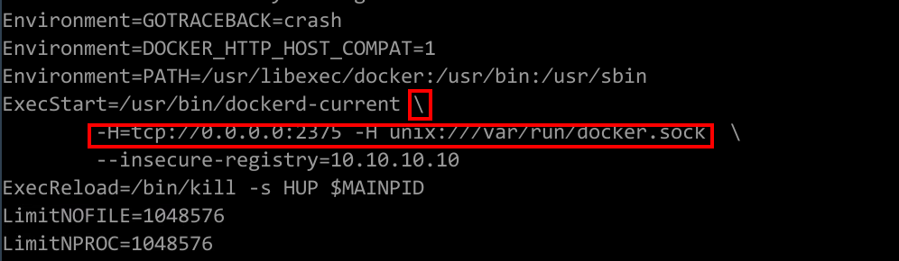
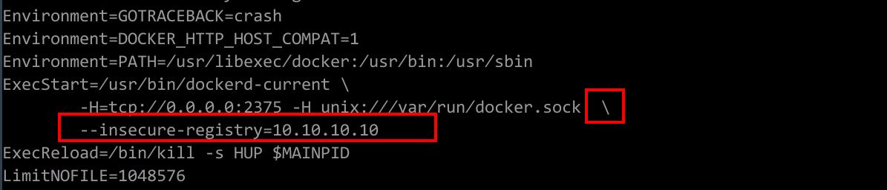
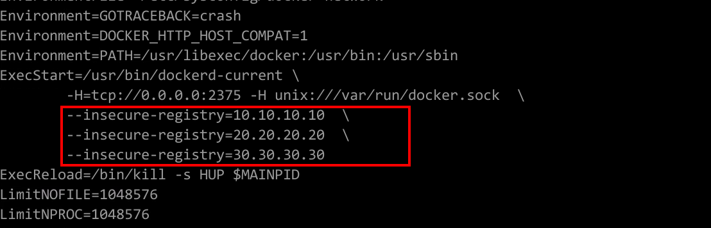
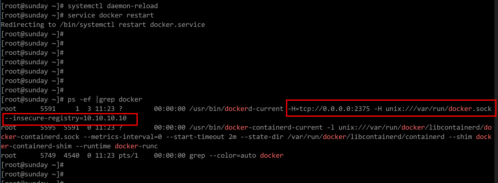
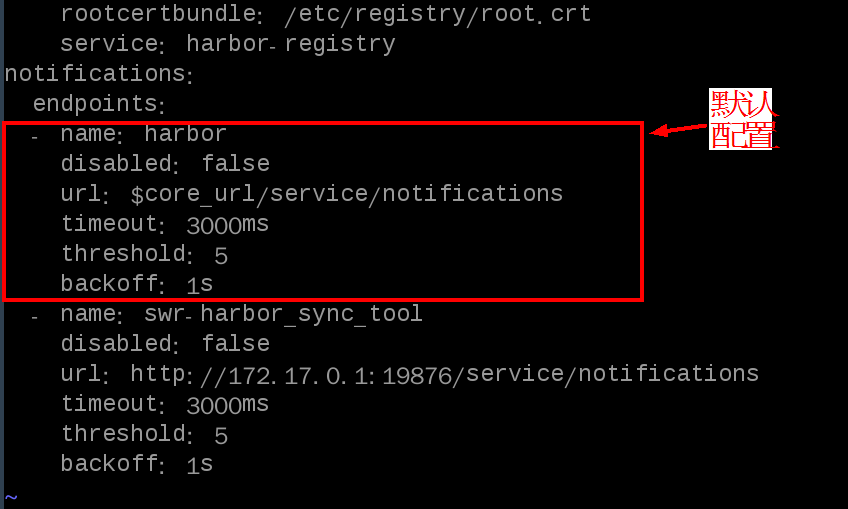

# 同步Harbor镜像<a name="swr_01_0041"></a>

## 前提条件<a name="section741973616251"></a>

可访问harbor仓库的用户节点执行以下命令下载harbor同步工具镜像。

```
docker pull swr.cn-north-1.myhuaweicloud.com/swr/swr_harbor_sync:v3.0
```

## 配置及运行<a name="section939563715224"></a>

1.  配置docker daemon。（配置文件目录通常为/lib/systemd/system/docker.service）
    1.  开启docker remote api，可以接受swr-harbor\_sync\_tool服务的请求，在配置文件的ExecStart选项中添加如下：

        ```
        -H=tcp://0.0.0.0:2375 -H unix:///var/run/docker.sock
        ```

        请确保前一个配置项末尾有 \\ 符号，如下图所示：

        

    2.  如果harbor开启的为http而非https，或者开启的是https但未在docker主机上安装https证书，在配置文件的ExecStart选项中添加如下：

        ```
        --insecure-registry=#harbor服务器的域名或IP#
        ```

        示例：

        ```
        --insecure-registry=10.10.10.10
        ```

        请确保前一个配置项末尾有 \\ 符号，如下图所示：

        

        请确认/etc/docker/daemon.json文件中是否存在insecure-registries配置项。如果存在，需要确保/lib/systemd/system/docker.service的insecure-registry配置项中的ip和/etc/docker/daemon.json的insecure-registries配置项中的ip是完全一致的。

        /lib/systemd/system/docker.service中多个insecure-registry需要按下图格式配置：

        

    3.  重启docker服务，执行如下命令。

        ```
        systemctl daemon-reload
        systemctl restart docker
        ```

        若执行systemctl restart docker命令无法启动重启docker服务，可执行service docker restart命令，重启docker服务。

    4.  确认参数是否生效 。
        1.  执行以下命令，查看docker进程。

            ```
            ps -ef|grep docker 
            ```

        2.  确认进程中是否含有如下参数。

            ```
            --insecure-registry=harobr服务器域名或ip -H=tcp://0.0.0.0:2375 -H unix:///var/run/docker.sock
            ```

            如下图所示：

            

            如果含有上述参数，则说明配置成功。


2.  配置并运行swr-harbor\_sync\_tool。
    1.  新建配置文件，在任意文件目录下，新建文件名：app.conf，填写相应的配置变量，模板如下：

        ```
        ImageOverwrite=false
        NamespaceMap=harbor_project1:swr_namespace1;harbor_project2:swr_namespace2
        HWAuthMethod=AKSK
        HWAK=XXXXXXXXXXXXX
        HWSK=XXXXXXXXXXXXXXXXXXXXX
        HWDomain=sunXXXXXX
        HWUser=XXXXXX
        HWPassword=XXXXXXX
        RegionName=cn-north-1
        HarborUser=admin
        HarborPassword=******
        HarborAddr=mango.nat300.top
        HarborProtocol=https
        ```

        **表 1**  参数说明

        <a name="table18583144310716"></a>
        <table><thead align="left"><tr id="row135842431876"><th class="cellrowborder" valign="top" width="50%" id="mcps1.2.3.1.1"><p id="p165848431471"><a name="p165848431471"></a><a name="p165848431471"></a>参数名称</p>
        </th>
        <th class="cellrowborder" valign="top" width="50%" id="mcps1.2.3.1.2"><p id="p145857438711"><a name="p145857438711"></a><a name="p145857438711"></a>参数解释</p>
        </th>
        </tr>
        </thead>
        <tbody><tr id="row1258511438716"><td class="cellrowborder" valign="top" width="50%" headers="mcps1.2.3.1.1 "><p id="p958517431178"><a name="p958517431178"></a><a name="p958517431178"></a>ImageOverwrite</p>
        </td>
        <td class="cellrowborder" valign="top" width="50%" headers="mcps1.2.3.1.2 "><p id="p1798510341086"><a name="p1798510341086"></a><a name="p1798510341086"></a>自动同步时，如果该镜像名已经存在于云镜像仓库，是否覆盖。</p>
        <p id="p458518430713"><a name="p458518430713"></a><a name="p458518430713"></a>默认为false，即不覆盖。</p>
        </td>
        </tr>
        <tr id="row175851643578"><td class="cellrowborder" valign="top" width="50%" headers="mcps1.2.3.1.1 "><p id="p17585643079"><a name="p17585643079"></a><a name="p17585643079"></a>NamespaceMap</p>
        </td>
        <td class="cellrowborder" valign="top" width="50%" headers="mcps1.2.3.1.2 "><p id="p175851843272"><a name="p175851843272"></a><a name="p175851843272"></a>自动同步镜像所对应的harbor projectname与华为swr namespace。</p>
        <p id="p6778182481010"><a name="p6778182481010"></a><a name="p6778182481010"></a>配置格式：harbor porjectname:华为swr namespace；若存在多组配置项，键值对之间用;分隔。</p>
        <p id="p4801849694"><a name="p4801849694"></a><a name="p4801849694"></a>例如：harbor_project1:swr_namespace1;harbor_project2:swr_namespace2</p>
        </td>
        </tr>
        <tr id="row6726185334714"><td class="cellrowborder" valign="top" width="50%" headers="mcps1.2.3.1.1 "><p id="p2072665316478"><a name="p2072665316478"></a><a name="p2072665316478"></a>HWAuthMethod</p>
        </td>
        <td class="cellrowborder" valign="top" width="50%" headers="mcps1.2.3.1.2 "><p id="p1672615314477"><a name="p1672615314477"></a><a name="p1672615314477"></a>可选AKSK、Password。如果是AKSK则使用HWAK、HWSK进行华为云鉴权；如果是Password，则使用HWDmain、HWUser、HWPassword进行华为云鉴权</p>
        </td>
        </tr>
        <tr id="row968815014713"><td class="cellrowborder" valign="top" width="50%" headers="mcps1.2.3.1.1 "><p id="p10688105084712"><a name="p10688105084712"></a><a name="p10688105084712"></a>HWAK</p>
        </td>
        <td class="cellrowborder" valign="top" width="50%" headers="mcps1.2.3.1.2 "><p id="p1668818502474"><a name="p1668818502474"></a><a name="p1668818502474"></a>华为云AK</p>
        </td>
        </tr>
        <tr id="row139751944114713"><td class="cellrowborder" valign="top" width="50%" headers="mcps1.2.3.1.1 "><p id="p9975244134719"><a name="p9975244134719"></a><a name="p9975244134719"></a>HWSK</p>
        </td>
        <td class="cellrowborder" valign="top" width="50%" headers="mcps1.2.3.1.2 "><p id="p59758447474"><a name="p59758447474"></a><a name="p59758447474"></a>华为云SK</p>
        </td>
        </tr>
        <tr id="row1158514318717"><td class="cellrowborder" valign="top" width="50%" headers="mcps1.2.3.1.1 "><p id="p35859431679"><a name="p35859431679"></a><a name="p35859431679"></a>HWDomain</p>
        </td>
        <td class="cellrowborder" valign="top" width="50%" headers="mcps1.2.3.1.2 "><p id="p2058511431777"><a name="p2058511431777"></a><a name="p2058511431777"></a>华为云租户名。</p>
        </td>
        </tr>
        <tr id="row113496431486"><td class="cellrowborder" valign="top" width="50%" headers="mcps1.2.3.1.1 "><p id="p113491443114815"><a name="p113491443114815"></a><a name="p113491443114815"></a>HWUser</p>
        </td>
        <td class="cellrowborder" valign="top" width="50%" headers="mcps1.2.3.1.2 "><p id="p1234964318488"><a name="p1234964318488"></a><a name="p1234964318488"></a>HWUser为华为云用户名，当用户名为空时，默认使用租户权限进行操作。</p>
        </td>
        </tr>
        <tr id="row5338912131319"><td class="cellrowborder" valign="top" width="50%" headers="mcps1.2.3.1.1 "><p id="p12338912191310"><a name="p12338912191310"></a><a name="p12338912191310"></a>HWPassword</p>
        </td>
        <td class="cellrowborder" valign="top" width="50%" headers="mcps1.2.3.1.2 "><p id="p14338131216131"><a name="p14338131216131"></a><a name="p14338131216131"></a>华为云密码。</p>
        </td>
        </tr>
        <tr id="row1527117620119"><td class="cellrowborder" valign="top" width="50%" headers="mcps1.2.3.1.1 "><p id="p72717611117"><a name="p72717611117"></a><a name="p72717611117"></a>RegionName</p>
        </td>
        <td class="cellrowborder" valign="top" width="50%" headers="mcps1.2.3.1.2 "><p id="p1927119691110"><a name="p1927119691110"></a><a name="p1927119691110"></a>华为云区域名，只能同步至以下的一个区域：</p>
        <a name="ul171051159181210"></a><a name="ul171051159181210"></a><ul id="ul171051159181210"><li>华北-北京一（cn-north-1）</li><li>华东-上海二（cn-east-2）</li><li>华南-广州（cn-south-1）</li><li>亚太-香港（ap-southeast-1）</li></ul>
        </td>
        </tr>
        <tr id="row1842939111110"><td class="cellrowborder" valign="top" width="50%" headers="mcps1.2.3.1.1 "><p id="p14429159151115"><a name="p14429159151115"></a><a name="p14429159151115"></a>HarborUser</p>
        </td>
        <td class="cellrowborder" valign="top" width="50%" headers="mcps1.2.3.1.2 "><p id="p114321011171211"><a name="p114321011171211"></a><a name="p114321011171211"></a>Harbor账号名。</p>
        </td>
        </tr>
        <tr id="row1534332161218"><td class="cellrowborder" valign="top" width="50%" headers="mcps1.2.3.1.1 "><p id="p5343521161215"><a name="p5343521161215"></a><a name="p5343521161215"></a>HarborPassword</p>
        </td>
        <td class="cellrowborder" valign="top" width="50%" headers="mcps1.2.3.1.2 "><p id="p113434219123"><a name="p113434219123"></a><a name="p113434219123"></a>Harbor密码。</p>
        </td>
        </tr>
        <tr id="row181091424141211"><td class="cellrowborder" valign="top" width="50%" headers="mcps1.2.3.1.1 "><p id="p20109142419122"><a name="p20109142419122"></a><a name="p20109142419122"></a>HarborAddr</p>
        </td>
        <td class="cellrowborder" valign="top" width="50%" headers="mcps1.2.3.1.2 "><p id="p16109162412125"><a name="p16109162412125"></a><a name="p16109162412125"></a>Harbor的域名或者IP。</p>
        </td>
        </tr>
        <tr id="row183291727171212"><td class="cellrowborder" valign="top" width="50%" headers="mcps1.2.3.1.1 "><p id="p33301727141215"><a name="p33301727141215"></a><a name="p33301727141215"></a>HarborProtocol</p>
        </td>
        <td class="cellrowborder" valign="top" width="50%" headers="mcps1.2.3.1.2 "><p id="p8330162710122"><a name="p8330162710122"></a><a name="p8330162710122"></a>harbor服务器的协议，可配置为http或https。</p>
        </td>
        </tr>
        </tbody>
        </table>

    2.  在app.conf所在目录下，执行以下命令运行容器。

        ```
        docker run -d --privileged=true -v /var:/var -p #swr-harbor_sync_tool服务暴露的主机端口#:5000 --env-file=#前文配置文件的路径# --restart=always #刚刚下载的镜像名#:#刚刚下载的镜像tag#
        ```

        示例：

        ```
        docker run -d --privileged=true -v /var/log:/var/log -p 19876:5000 --env-file=app.conf --restart=always swr.cn-north-1.myhuaweicloud.com/swr/swr_harbor_sync:v3.0
        ```

        > **说明：**   
        >请确保harbor服务为启动状态；若未启动，在harbor安装目录中，使用./install.sh命令启动harbor。  

        容器运行日志路径：/var/log/swr\_harbor\_sync，其中running.log为服务运行日志，projectname-running.log为记录对应projectname的harbor项目同步情况的日志，projectname-success.log记录对应projectname的harbor项目同步成功的日志。如果app.conf中的配置信息有误，请修改配置文件，并停止刚刚启动的容器后，重新运行一个新容器。


3.  配置harbor服务。
    1.  在harbor/common/templates/registry/config.yml中的notifications的endpoints下，新增一个endpoint，格式如下：

        ```
          - name: swr-harbor_sync_tool
            disabled: false
            url: http://10.10.10.10:19876/service/notifications
            timeout: 3000ms
            threshold: 5
            backoff: 1s
        ```

        请将10.10.10.10:19876更换为部署swr-harbor\_sync\_tool服务所在的主机ip（请勿使用127.0.0.1作为IP，请使用宿主机IP或域名）以及服务在主机实际暴露的端口。

        请确保新增配置格式正确，即和默认的endpoint格式完全一致对齐（行前空格的差异会导致harbor无法正常重新启动），如下图所示：

        

    2.  重新启动harbor服务。

        在harbor安装目录中，使用./install.sh命令启动harbor。请确认harbor服务启动后是否正常运行：使用docker ps指令确认所有的harbor容器都是up状态。


## 如何使用swr-harbor\_sync\_tool<a name="section828111971919"></a>

1.  swr-harbor\_sync\_tool运行后，会自动将push到Harbor仓库的镜像同步到华为云仓库内。
    -   自动同步的过程：
        1.  当用户通过docker push将镜像推送到Harbor服务器时，Harbor服务器的notifications功能（即前面配置Harbor服务的endpoints）会自动发送请求到swr-harbor\_sync\_tool服务，请求中会包含本次push的镜像名和tag以及projectname。
        2.  swr-harbor\_sync\_tool服务接到notifications之后，查询swr-harbor\_sync\_tool服务的配置文件（即前面配置本服务的app.conf）中的NamespaceMap。
            -   如果用户push的目标harbor projectname在配置文件中存在，且有对应的正确的华为云namespace，执行[1.c](#li1384610303173)。
            -   如果用户push的目标harbor projectname在配置文件中不存在，则不同步。

        3.  <a name="li1384610303173"></a>swr-harbor\_sync\_tool服务会根据请求中的镜像名和tag，将该镜像从Harbor中pull下来，然后将pull下来的镜像打上对应的华为云镜像tag，再push到配置文件（即前面配置本服务的app.conf）中所配置的华为云账号以及配置的Region区域所对应的华为云的namespace上。
        4.  最后，将pull下来的镜像以及tag的镜像都删除。

    -   同步后，该镜像在华为云上的Repo名和tag与harbor上的是一致的。若出现不一致，可能有以下常见异常：

        1.  未在配置文件中配置需要自动同步的harbor projectname及华为云namespace。
        2.  华为Namespace已经被别的华为云用户使用。

        如未成功同步，请到/var/log/swr\_harbor\_sync目录下的日志文件中查看失败原因。


2.  手动将Harbor中指定的project内的所有镜像同步到华为云中指定的namespace内。
    -   接口如下（curl指令形式）：

        ```
        curl -X POST -H 'Projectname:##harbor项目名##' -H 'Namespace:##华为swr命名空间##' -H 'HarborUser:##harbor用户名##' -H 'HarborPassword:##harbor密码##' -H 'HWAuthMethod:##华为云认证方式##' -H 'HWAK:##华为云AK##' -H 'HWSK:##华为云SK##' -H 'HWDomain:##华为云租户名##' -H 'HWUser:#华为云账号名#' -H 'HWPassword:##华为云租户或账号密码##' -H 'RegionName:##华为云区域名##' -H 'ImageOverwrite:##重名镜像是否覆盖，可选true或者false##' http://##部署swr-harbor_sync_tool节点的IP##:##部署swr-harbor_sync_tool的PORT##/service/synchronization/namespace
        ```

    -   示例：

        ```
        curl -X POST -H 'Projectname:harbor_project_name' -H 'Namespace:huaweicloud_namespace_name' -H 'HarborUser:harbor_user' -H 'HarborPassword:harbor_password' -H 'HWAuthMethod:huawei_auth_method' -H 'HWAK:huawei_ak' -H 'HWSK:huawei_sk' -H 'HWDomain:huaweicloud_domain_name' -H 'HWUser:huaweicloud_user_name' -H 'HWPassword:huaweicloud_password' -H 'RegionName:cn-north-1' -H 'ImageOverwrite:false' http://127.0.0.1:19876/service/synchronization/namespace
        ```

        1.  swr-harbor\_sync\_tool服务收到请求后，会确认library是否为公有项目。
            -   如果为公有项目，则不对harbor账号密码鉴权。
            -   如果是私有项目，则对harbor账号密码（admin：\*\*\*\*\*\*）鉴权。

        2.  如果HWAuthMethod为AKSK，则获取HWAK、HWSK进行权限认证；如果HWAuthMethod为Password，则判断如果HWUser为空，则对华为云租户及租户密码（abcXXX：xyzXXX）鉴权；如果HWUser非空，则对华为云租户、账号及账户密码（abcXXX：bbbXXX：xyzXXX）鉴权；并确认RegionName和Namespace是否可用。

            当这些都确认正确后，swr-harbor\_sync\_tool服务会将harbor中library这个project内的所有镜像，全部同步到华为云该租户下的（cn-north-1）区域的镜像仓库内的namespace（domain\_library）中，且由于ImageOverwrite设置为false，则不会覆盖原有的同名镜像。

            > **说明：**   
            >因为请求用例是在部署了swr-harbor\_sync\_tool的节点上运行的，因此请求的ip为127.0.0.1。  


## 常见异常<a name="section164989101977"></a>

1.  harbor Projectname填写错误。
2.  华为Namespace已经被别的华为云用户使用。
3.  华为租户名/账号名/密码填写错误。
4.  华为区域名填写错误。
5.  harbor账号密码错误。
6.  运行工具的节点无法访问harbor或者swr，网络不通。

如未成功同步，请在/var/log/swr\_harbor\_sync目录下的对应projectname的projectname-running.log日志文件中查看失败原因。如未发现错误信息，请确认配置及运行的步骤1和3是否正确配置。

