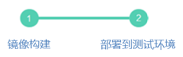

# 场景描述

不同场景交付镜像的流水线也不同，以下是几个常见场景示例：

-   **场景一：基于源码的编译、构建和部署**

    **用户代码托管在主流公共仓库**（gitlab, github, gitee），使用云容器CI/CD，自定义Jenkins脚本对代码进行编译、并进行镜像构建、上传到SWR镜像仓库、部署的流程。

    **图 1**  基于源码的编译、构建和部署  
    

-   **场景二：基于源码的构建和部署**

    **用户代码托管在主流公共仓库**（gitlab, github, gitee），将用户所指定的源码打包成镜像，一般用于基础镜像构建、静态网站镜像构建等，如：将公用代码打入基础镜像，业务镜像构建时基于基础镜像的代码进行编译，或将网站前端的HTML，Javascript, css等静态文件构建成镜像。

    **图 2** **基于源码的构建和部署**  
    

-   **场景三：对接第三方Jenkins实现镜像构建和部署**

    **用户使用外网Jenkins环境**（可从华为云访问到该Jenkins） ，安装华为云提供的Jenkins插件后，对接云容器CI/CD，插件会将Jenkins编译的包上传到SWR软件仓库，然后进行打包镜像，再进行部署。

    **图 3** **对接第三方Jenkins实现镜像构建和部署**  
    

-   **场景四：基于二进制文件进行镜像构建和部署**

    **场景4：用户使用内网Jenkins环境**（无法从华为云访问到该Jenkins）**或无Jenkins**，用户手动将编译好的软件包上传到SWR软件仓库，然后进行镜像构建和部署。

    **图 4** **基于二进制文件进行镜像构建和部署**  
    

