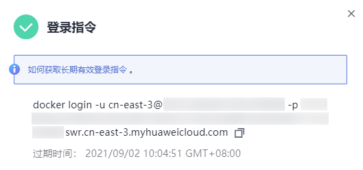

# 客户端上传镜像<a name="swr_01_0011"></a>

## 操作场景<a name="section582103934115"></a>

本章节以[容器引擎基础知识](容器引擎基础知识.md)中制作的**nginx:v1**镜像为例，介绍如何使用客户端上传镜像。客户端上传镜像，是指在安装了容器引擎客户端的机器上使用docker命令将镜像上传到容器镜像服务的镜像仓库。

如果容器引擎客户端机器为云上的ECS或CCE节点，根据机器所在区域有两种网络链路可以选择：

-   若机器与容器镜像仓库在同一区域，则上传镜像走内网链路。
-   若机器与容器镜像仓库不在同一区域，则上传镜像走公网链路，机器需要绑定弹性公网IP。

## 约束与限制<a name="section1577223318127"></a>

-   使用客户端上传镜像，镜像的每个layer大小不能超过10G。
-   上传镜像的容器引擎客户端版本必须为1.11.2及以上。

## 前提条件<a name="section1409154617177"></a>

已创建组织，请参见[创建组织](组织管理.md#section12921632181415)。

## 操作步骤<a name="zh-cn_topic_0083050718_section862311112816"></a>

1.  连接容器镜像服务。
    1.  登录容器镜像服务控制台。
    2.  <a name="zh-cn_topic_0112596104_li182568055016"></a>选择左侧导航栏的“总览“，单击页面右上角的“登录指令“，在弹出的页面中单击复制登录指令。

        **图 1**  登录指令<a name="fig20201723105016"></a>  
        

        > **说明：** 
        >-   此处生成的登录指令有效期为24小时，若需要长期有效的登录指令，请参见[获取长期有效登录指令](获取长期有效登录指令.md)。获取了长期有效的登录指令后，在有效期内的临时登录指令仍然可以使用。
        >-   登录指令末尾的域名为镜像仓库地址，请记录该地址，后面会使用到。

    3.  在安装容器引擎的机器中执行上一步复制的登录指令。

        登录成功会显示“Login Succeeded“。

2.  在安装容器引擎的机器上执行以下命令，为**nginx**镜像打标签。

    **docker tag**  \[镜像名称1:版本名称1\] \[镜像仓库地址\]/\[组织名称\]/\[镜像名称2:版本名称2\]

    其中，

    -   \[镜像名称1:版本名称1\]：请替换为您所要上传的实际镜像的名称和版本名称。
    -   \[镜像仓库地址\]：可在SWR控制台上查询，即[1.b](#zh-cn_topic_0112596104_li182568055016)中登录指令末尾的域名。
    -   \[组织名称\]：请替换为您创建的组织。
    -   \[镜像名称2:版本名称2\]：请替换为您期待的镜像名称和镜像版本。

    示例：

    **docker tag nginx:v1 swr.cn-east-3.myhuaweicloud.com/cloud-develop/nginx:v1**

3.  上传镜像至镜像仓库。

    **docker push**  \[镜像仓库地址\]/\[组织名称\]/\[镜像名称2:版本名称2\]

    示例：

    **docker push swr.cn-east-3.myhuaweicloud.com/cloud-develop/nginx:v1**

    终端显示如下信息，表明上传镜像成功。

    ```
    The push refers to repository [swr.cn-east-3.myhuaweicloud.com/cloud-develop/nginx:v1]
    fbce26647e70: Pushed 
    fb04ab8effa8: Pushed 
    8f736d52032f: Pushed 
    009f1d338b57: Pushed 
    678bbd796838: Pushed 
    d1279c519351: Pushed 
    f68ef921efae: Pushed 
    v1: digest: sha256:0cdfc7910db531bfa7726de4c19ec556bc9190aad9bd3de93787e8bce3385f8d size: 1780
    ```

    返回容器镜像服务控制台，在“我的镜像“页面，执行刷新操作后可查看到对应的镜像信息。


## 常见问题<a name="section1898173215570"></a>

[为什么使用客户端上传镜像失败？](https://support.huaweicloud.com/swr_faq/swr_faq_0006.html)

