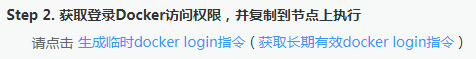

# 客户端上传镜像<a name="swr_01_0011"></a>

本章节以**2048-demo:v1**镜像为例，介绍如何上传镜像。

## 前提条件<a name="section1409154617177"></a>

已创建组织，请参见[创建组织](上传镜像至容器镜像服务.md#section89499612716)。

## 客户端上传镜像<a name="zh-cn_topic_0083050718_section862311112816"></a>

docker客户端上传镜像，是指使用docker命令将镜像上传到容器镜像服务的镜像仓库。

本章节以**2048-demo:v1**镜像为例，介绍如何上传镜像。上传成功后，在“我的镜像“中显示已上传成功的镜像。

> **注意：**   
>-   使用客户端上传镜像，镜像的每个layer大小不能超过10G。  
>-   上传镜像的Docker客户端版本必须为1.11.2及以上。  

1.  连接容器镜像服务。
    1.  登录容器镜像服务控制台。
    2.  在左侧菜单栏选择“我的镜像“，单击右侧“客户端上传“，在弹出的页面中单击“生成临时的docker login指令“，单击复制docker login指令。docker login指令末尾的域名即为当前镜像仓库地址，记录该地址。

        **图 1**  获取docker login指令<a name="swr_01_0009_fig13751239104219"></a>  
        

        > **说明：**   
        >此处获取的docker login指令有效期为16小时，若需要长期有效的docker login指令，请参见[获取长期有效docker login指令](获取长期有效docker-login指令.md)。  

    3.  在安装Docker的机器中执行上一步复制的docker login指令。

        登录成功会显示“login succeeded“。


2.  在安装docker的机器给**2048-demo:v1**镜像打标签。

    docker tag \[镜像名:版本号\] \[镜像仓库地址\]/\[组织名称\]/\[镜像名:版本号\]

    样例如下：

    docker tag 2048-demo:v1 swr.cn-north-1.myhuaweicloud.com/group/2048-demo:v1

    其中：

    -   swr.cn-north-1.myhuaweicloud.com为容器镜像服务的镜像仓库地址。
    -   group为组织名称，如果该组织还没有创建，容器镜像服务会根据组织名称自动创建一个组织。
    -   2048-demo:v1 为镜像名称和版本号。

3.  上传镜像至镜像仓库。

    docker push \[镜像仓库地址\]/\[组织名称\]/\[镜像名:版本号\]

    样例如下：

    docker push swr.cn-north-1.myhuaweicloud.com/group/2048-demo:v1

    终端显示如下信息，表明push镜像成功。

    ```
    6d6b9812c8ae: Pushed 
    695da0025de6: Pushed 
    fe4c16cbf7a4: Pushed 
    v1: digest: sha256:eb7e3bbd8e3040efa71d9c2cacfa12a8e39c6b2ccd15eac12bdc49e0b66cee63 size: 948
    ```

    返回系统，在“我的镜像“页面，执行刷新操作后可查看到对应的镜像信息。


