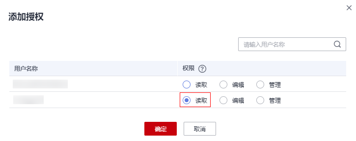
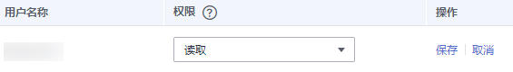
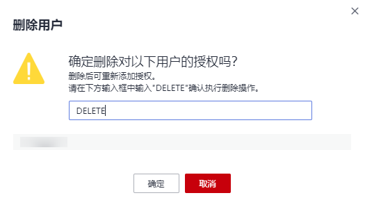
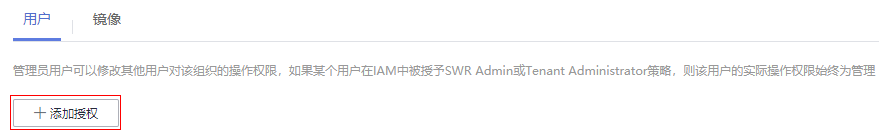

# 授权管理

## 操作场景

如果您需要对容器镜像服务进行权限管理，您可以使用统一身份认证服务IAM，设置权限的方法请参见[创建用户并授权使用SWR](创建用户并授权使用SWR.md)。当您具有SWR Admin或者Tenant Administrator系统权限时，您就拥有了SWR的管理员权限，可以在SWR中为其他IAM用户进行授权。

> **说明：** 
>拥有SWR管理员权限的用户，默认拥有所有组织下的镜像管理权限，即使该用户不在组织的授权用户列表中。

如果您没有SWR的管理员权限，就需要已拥有SWR管理员权限的用户在SWR中进行授权管理，为您添加对某个镜像的权限或对某个组织中所有镜像的权限。

**场景示例：**

-   示例一：我是拥有ServiceStage Developer权限（SWR只读权限）的IAM用户，想要下载SWR管理员所创建的“group“组织下的“nginx“镜像。

    策略：SWR管理员在“nginx“镜像详情中为您授予“读取“权限，授权完成后，您将享有下载该镜像的权限。

-   示例二：我是SWR管理员，需要给公司外部员工授权一个组织的镜像上传权限，但是不允许他登录控制台，只能通过Docker客户端push镜像。

    策略：您在组织详情“用户“页签下为该员工授予“编辑“权限，并且在IAM中设置访问方式为“编程访问“。

    **图 1**  修改访问方式示例  
    

## 授权方法

容器镜像服务中给IAM用户添加权限有如下两种方法：

-   [在镜像详情中添加授权](#section851514354541)，授权完成后，IAM用户享有读取/编辑/管理该镜像的权限。
-   [在组织中添加授权](#section950354645517)，使IAM用户对组织内所有镜像享有读取/编辑/管理的权限。

    **图 2**  用户权限  
    

容器镜像服务中为用户添加的权限有如下三种类型：

-   读取：只能下载镜像，不能上传。
-   编辑：下载镜像、上传镜像、编辑镜像属性以及添加触发器。
-   管理：下载镜像、上传镜像、删除镜像或版本、编辑镜像属性、添加授权、添加触发器以及共享镜像。

> **说明：** 
>页面上传镜像功能要求具备组织的编辑或管理权限，在镜像详情中添加的编辑或管理权限不支持页面上传镜像。

## 在镜像详情中添加授权

在镜像详情中为IAM用户添加授权，授权完成后，该帐号下IAM用户享有读取/编辑/管理该镜像的权限。

1.  登录容器镜像服务控制台。
2.  在左侧导航栏选择“我的镜像“，单击右侧待编辑镜像的名称。
3.  在镜像详情页面选择“权限管理“页签。

    **图 3**  权限管理  
    

4.  单击“添加授权“，选择IAM用户名称，添加“读取/编辑/管理“的权限，添加后，该IAM用户享有对应权限。

    **图 4**  在镜像详情中添加授权  
    

## 在镜像详情中修改/删除授权

您还可以在镜像详情中修改用户权限及删除用户权限。

-   修改授权：在“权限管理“页签下用户所在行单击“修改“，在“权限“所在列选择新的权限，然后单击“保存“。

    **图 5**  在镜像详情中修改授权  
    

-   删除授权：在“权限管理“页签下用户所在行单击“删除“。在弹出的对话框中根据提示输入“DELETE“，然后单击“确定“。

    **图 6**  在镜像详情中删除授权  
    

## 在组织中添加授权

IAM用户创建后，需要管理员在组织中为用户添加授权，使IAM用户对组织内所有镜像享有读取/编辑/管理的权限。

只有具备“管理“权限的帐号和IAM用户才能添加授权。

1.  登录容器镜像服务控制台。
2.  在左侧菜单栏选择“组织管理“，单击右侧组织名称后的“详情”。
3.  在“用户“页签下单击“添加授权“，在弹出的窗口中为IAM用户选择权限，然后单击“确定“。

    **图 7**  在组织中添加授权  
    

## 在组织中修改/删除授权

您还可以在组织中修改用户权限及删除用户权限。

-   修改授权：在“用户“页签下用户所在行单击“修改“，在“权限“所在列选择新的权限，然后单击“保存“。

    **图 8**  在组织中修改授权  
    

-   在“用户“页签下用户所在行单击“删除“。在弹出的对话框中根据提示输入“DELETE“，然后单击“确定“。

    **图 9**  在组织中删除授权  
    

