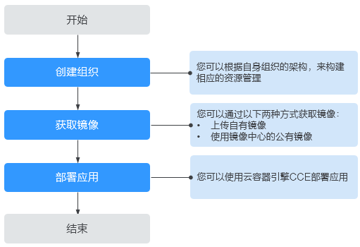

# 欢迎使用容器镜像服务

容器镜像服务（Software Repository for Container，简称SWR）是一种支持镜像全生命周期管理的服务，提供简单易用、安全可靠的镜像管理功能，包括镜像的上传、下载、删除等。

SWR提供私有镜像库，并支持细粒度的权限管理，可以为不同用户分配相应的访问权限（读取、编辑、管理）。SWR还支持容器镜像版本更新自动触发部署。您只需要为镜像设置一个触发器，通过触发器，可以在每次镜像版本更新时，自动更新云容器引擎（CCE）中使用该镜像部署的应用。

您可以通过[控制台](https://console.huaweicloud.com/swr/)、[API](https://support.huaweicloud.com/api-swr/swr_02_0065.html)使用容器镜像服务。

**图 1**  SWR使用流程  

