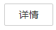

# 添加授权

在组织中为用户添加授权，使用户对组织内所有镜像享有读取/编辑/管理的权限。

用户权限分为三类。

-   读取：只能下载镜像，不能上传。
-   编辑：下载镜像、上传镜像、编辑镜像属性以及创建触发器。
-   管理：下载镜像、上传镜像、删除镜像或版本、编辑镜像属性、添加授权、添加触发器以及共享镜像。

## 前提条件

只有具备“管理“权限的用户才能添加授权。

## 操作步骤

1.  登录容器镜像服务控制台。
2.  在左侧菜单栏选择“组织管理“，单击右侧组织名称后的。
3.  在“用户“页签下单击“添加授权“，在弹出的窗口中为用户选择权限，然后单击“确定“。

    **图 1**  添加授权  
    

