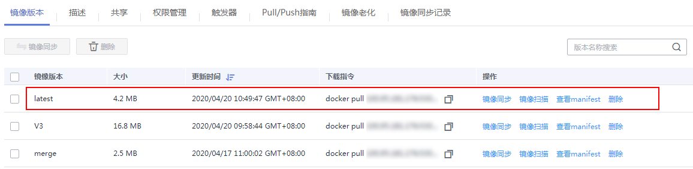
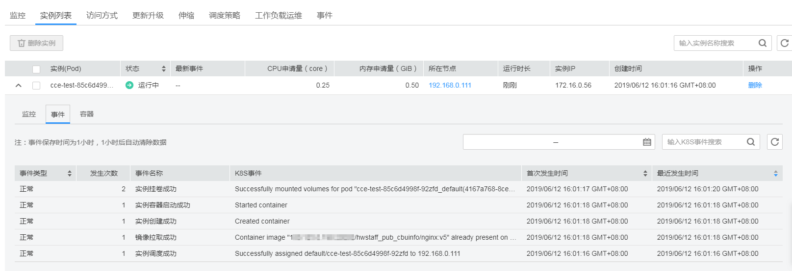
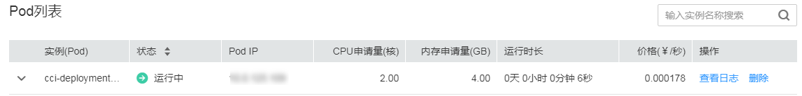

# 添加触发器

容器镜像服务可搭配云容器引擎CCE、云容器实例CCI一起使用，实现镜像版本更新时自动更新使用该镜像的应用。您只需要为镜像添加一个触发器。通过触发器，可以在每次生成新的镜像版本时，自动执行更新动作，如：自动更新使用该镜像的应用。

## 前提条件

更新应用镜像版本之前，请确保已创建容器应用，将镜像部署到云容器引擎CCE或云容器实例CCI。

如未创建，请登录云容器引擎创建工作负载页面进行创建，具体创建方法请参见[创建无状态工作负载](https://support.huaweicloud.com/usermanual-cce/cce_01_0047.html)或[创建有状态工作负载](https://support.huaweicloud.com/usermanual-cce/cce_01_0048.html)，或登录云容器实例创建无状态负载页面进行创建，具体创建方法请参见[创建无状态负载](https://support.huaweicloud.com/usermanual-cci/cci_01_0011.html#section0)。

## 操作步骤

1.  登录容器镜像服务控制台。
2.  在左侧菜单栏选择“我的镜像“，单击右侧镜像名称，进入镜像详情页。
3.  选择“触发器“页签，单击“添加触发器“，根据[表1](#table156232449577)填写相关参数，然后单击“确定“。

    **图 1**  添加触发器  
    

    **表 1**  触发器

    
    <table><thead align="left"><tr id="row362424415719"><th class="cellrowborder" valign="top" width="16%" id="mcps1.2.3.1.1">
参数

    </th>
    <th class="cellrowborder" valign="top" width="84%" id="mcps1.2.3.1.2">
说明

    </th>
    </tr>
    </thead>
    <tbody><tr id="row126241344125712"><td class="cellrowborder" valign="top" width="16%" headers="mcps1.2.3.1.1 ">
触发器名称

    </td>
    <td class="cellrowborder" valign="top" width="84%" headers="mcps1.2.3.1.2 ">
字母开头，由字母、数字、下划线(_)、中划线(-)组成，下划线、中划线不能连续且不能作为结尾，1-64个字符。

    </td>
    </tr>
    <tr id="row1462434455710"><td class="cellrowborder" valign="top" width="16%" headers="mcps1.2.3.1.1 ">
触发条件

    </td>
    <td class="cellrowborder" valign="top" width="84%" headers="mcps1.2.3.1.2 ">
支持如下三种触发条件，当镜像有新版本时，触发部署应用。

    <ul id="ul1923411281905"><li>全部触发：有新的镜像版本生成或镜像版本发生更新时，触发部署。</li><li>指定版本号触发：有指定镜像版本生成或更新时，触发部署。</li><li>正则触发：有符合正则表达式的镜像版本生成或更新时，触发部署。</li></ul>
    </td>
    </tr>
    <tr id="row1362494415711"><td class="cellrowborder" valign="top" width="16%" headers="mcps1.2.3.1.1 ">
触发动作

    </td>
    <td class="cellrowborder" valign="top" width="84%" headers="mcps1.2.3.1.2 ">
当前仅支持更新容器的镜像，需指定更新的应用，以及该应用下的指定容器镜像。

    </td>
    </tr>
    <tr id="row2034315951713"><td class="cellrowborder" valign="top" width="16%" headers="mcps1.2.3.1.1 ">
触发器状态

    </td>
    <td class="cellrowborder" valign="top" width="84%" headers="mcps1.2.3.1.2 ">
选择“启用”。

    </td>
    </tr>
    <tr id="row485114814505"><td class="cellrowborder" valign="top" width="16%" headers="mcps1.2.3.1.1 ">
触发器类型

    </td>
    <td class="cellrowborder" valign="top" width="84%" headers="mcps1.2.3.1.2 ">
选择“云容器引擎CCE”或“云容器实例CCI”。

    
 说明： 

当前仅“华北-北京一”、“华北-北京四”区域支持“云容器实例CCI”的触发器类型。

    

    </td>
    </tr>
    <tr id="row1867154816580"><td class="cellrowborder" valign="top" width="16%" headers="mcps1.2.3.1.1 ">
选择应用

    </td>
    <td class="cellrowborder" valign="top" width="84%" headers="mcps1.2.3.1.2 ">
选择要更新镜像的容器。

    </td>
    </tr>
    </tbody>
    </table>

## 验证操作

本例中触发条件为全部触发，即有新的镜像版本生成或镜像版本发生更新时，触发应用部署。

上传新的镜像版本至容器镜像服务的镜像仓库中，可在镜像详情页查看新上传的镜像版本。

**图 2**  查看镜像版本  

-   触发器类型设置为“云容器引擎CCE”时，登录云容器引擎服务控制台，在左侧菜单栏选择“工作负载”，单击要查看的工作负载名称，进入工作负载详情页面。

    在“实例列表”页签，可以看到应用实例正在创建。待实例创建成功，说明应用已更新完成。

    **图 3**  CCE应用已更新完成  
    

    在“访问方式”页签中获取访问地址，可以访问应用页面，看到已更新的应用信息。

-   触发器类型设置为“云容器实例CCI”时，登录云容器实例服务控制台，在左侧菜单栏选择“工作负载 \> 无状态（Deployment）”，单击要查看的无状态负载名称，进入无状态负载详情页面。

    在“Pod列表”中，可以看到应用实例正在创建。待实例创建成功，说明应用已更新完成。

    **图 4**  CCI应用已更新完成  
    

    在“访问配置”中获取访问地址，可以访问应用页面，看到已更新的应用信息。

