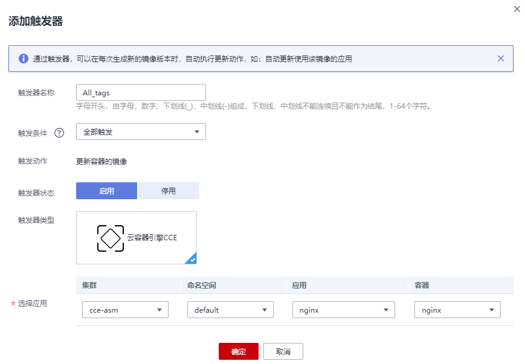
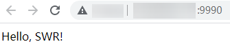
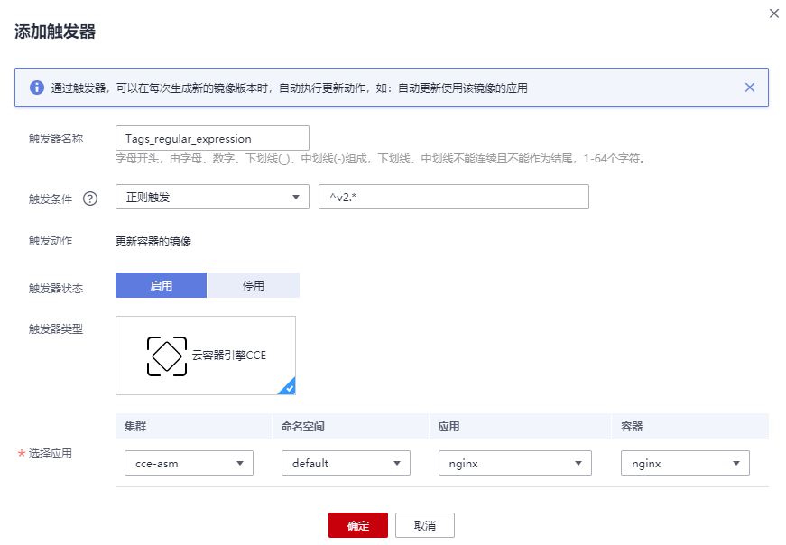
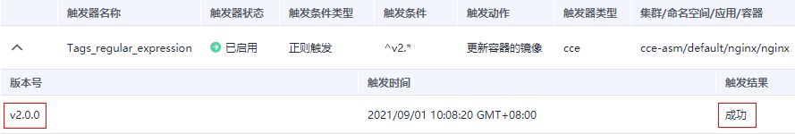

# 添加触发器

## 操作场景

容器镜像服务可搭配云容器引擎CCE、云容器实例CCI一起使用，实现镜像版本更新时自动更新使用该镜像的应用。您只需要为镜像添加一个触发器，通过触发器，可以在每次生成新的镜像版本时，自动执行更新动作，如：自动更新使用该镜像的应用。

> **说明：** 
>目前仅“华北-北京四”区域支持添加云容器实例CCI类型的触发器。

## 前提条件

更新应用镜像版本之前，请确保已创建容器应用，将镜像部署到云容器引擎CCE或云容器实例CCI。

如未创建，请登录云容器引擎工作负载页面进行创建，具体创建方法请参见[创建无状态负载（Deployment）](https://support.huaweicloud.com/usermanual-cce/cce_01_0047.html)或[创建有状态负载（StatefulSet）](https://support.huaweicloud.com/usermanual-cce/cce_01_0048.html)，或登录云容器实例无状态负载页面进行创建，具体创建方法请参见[创建无状态负载](https://support.huaweicloud.com/usermanual-cci/cci_01_0011.html#section0)。

## 操作步骤

1.  登录容器镜像服务控制台。
2.  在左侧导航栏选择“我的镜像“，单击右侧镜像名称，进入镜像详情页。
3.  选择“触发器“页签，单击“添加触发器“，根据[表1](#table156232449577)填写相关参数，然后单击“确定“。

    **图 1**  添加触发器  
    

    **表 1**  触发器

    
    <table><thead align="left"><tr id="row362424415719"><th class="cellrowborder" valign="top" width="16%" id="mcps1.2.3.1.1">
参数

    </th>
    <th class="cellrowborder" valign="top" width="84%" id="mcps1.2.3.1.2">
说明

    </th>
    </tr>
    </thead>
    <tbody><tr id="row126241344125712"><td class="cellrowborder" valign="top" width="16%" headers="mcps1.2.3.1.1 ">
触发器名称

    </td>
    <td class="cellrowborder" valign="top" width="84%" headers="mcps1.2.3.1.2 ">
自定义触发器的名称。

    
字母开头，由字母、数字、下划线_、中划线-组成，下划线、中划线不能连续且不能作为结尾，1-64个字符。

    </td>
    </tr>
    <tr id="row1462434455710"><td class="cellrowborder" valign="top" width="16%" headers="mcps1.2.3.1.1 ">
触发条件

    </td>
    <td class="cellrowborder" valign="top" width="84%" headers="mcps1.2.3.1.2 ">
支持如下三种触发条件，当镜像有新版本时，触发部署应用。

    <ul id="ul1923411281905"><li>全部触发：有新的镜像版本生成或镜像版本发生更新时，触发部署。</li><li>指定版本号触发：有指定镜像版本生成或更新时，触发部署。</li><li>正则触发：有符合正则表达式的镜像版本生成或更新时，触发部署。正则表达式规则如下：<ul id="ul359181755212"><li><strong id="b199512396517">*</strong>：匹配不包含路径分隔符“/”的任何字段。</li><li><strong id="b1471924219514">**</strong>：匹配包含路径分隔符“/”的任何字段。</li><li><strong id="b146701646105114">?</strong>：匹配任何单个非“/”的字符。</li><li><strong id="b12446752105119">{选项1, 选项2, ...}</strong>：同时匹配多个选项。</li></ul>
    </li></ul>
    </td>
    </tr>
    <tr id="row1362494415711"><td class="cellrowborder" valign="top" width="16%" headers="mcps1.2.3.1.1 ">
触发动作

    </td>
    <td class="cellrowborder" valign="top" width="84%" headers="mcps1.2.3.1.2 ">
当前仅支持更新容器的镜像，需指定更新的应用，以及该应用下的容器。

    </td>
    </tr>
    <tr id="row2034315951713"><td class="cellrowborder" valign="top" width="16%" headers="mcps1.2.3.1.1 ">
触发器状态

    </td>
    <td class="cellrowborder" valign="top" width="84%" headers="mcps1.2.3.1.2 ">
选择“启用”。

    </td>
    </tr>
    <tr id="row485114814505"><td class="cellrowborder" valign="top" width="16%" headers="mcps1.2.3.1.1 ">
触发器类型

    </td>
    <td class="cellrowborder" valign="top" width="84%" headers="mcps1.2.3.1.2 ">
选择“云容器引擎CCE”或“云容器实例CCI”。

    
 说明： 

当前仅“华北-北京四”区域支持“云容器实例CCI”的触发器类型。

    

    </td>
    </tr>
    <tr id="row1867154816580"><td class="cellrowborder" valign="top" width="16%" headers="mcps1.2.3.1.1 ">
选择应用

    </td>
    <td class="cellrowborder" valign="top" width="84%" headers="mcps1.2.3.1.2 ">
选择要更新镜像的容器。

    </td>
    </tr>
    </tbody>
    </table>

## 示例1：触发条件为“全部触发“

假设有一个欢迎页面为“Hello, SWR!“的Nginx镜像（版本号为v1），使用该镜像创建了名称为“nginx“的无状态负载，该负载提供对外访问。

1.  为Nginx镜像添加触发器。

    触发器名称填写“All\_tags“，触发条件选择“全部触发“，选择使用了Nginx镜像的无状态负载及容器。

    **图 2**  添加触发器  
    

2.  Nginx镜像新增一个v2版本，该版本的欢迎页面为“Hello, SoftWare Repository for Container!“。

    **图 3**  镜像版本v2  
    

3.  确认是否触发成功。

    在“触发器“页签，单击图标，查看触发结果为“成功“。

    **图 4**  触发结果  
    

    工作负载的访问页面已变更为“Hello, SoftWare Repository for Container!“。

    

## 示例2：触发条件为“正则触发“

假设有一个欢迎页面为“Hello, SWR!“的Nginx镜像（版本号为v1），使用该镜像创建了名称为“nginx“的无状态负载，该负载提供对外访问。

1.  为Nginx镜像添加触发器。

    触发器名称填写“Tags\_regular\_expression“，触发条件选择“正则触发“，输入正则表达式：^v2.\*（匹配以v2开头的版本号），选择使用了Nginx镜像的无状态负载及容器。

    **图 5**  添加触发器  
    

2.  Nginx镜像新增一个v1.0.0版本，该版本的欢迎页面为“Hello, SWR! \(v1.0.0\)“。

    **图 6**  镜像版本v1.0.0  
    

3.  Nginx镜像新增一个v2.0.0版本，该版本的欢迎页面为“Hello, SWR! \(v2.0.0\)“。

    **图 7**  镜像版本v2.0.0  
    

4.  确认是否触发成功。

    在“触发器“页签，单击图标，查看触发结果。从[图8](#fig288893010313)中可以看出，只有v2.0.0版本被触发了，符合设置的正则表达式规则。

    **图 8**  触发结果  
    

    工作负载的访问页面已变更为“Hello, SWR! \(v2.0.0\)“。

    

