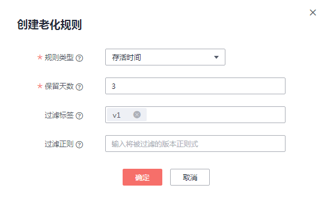
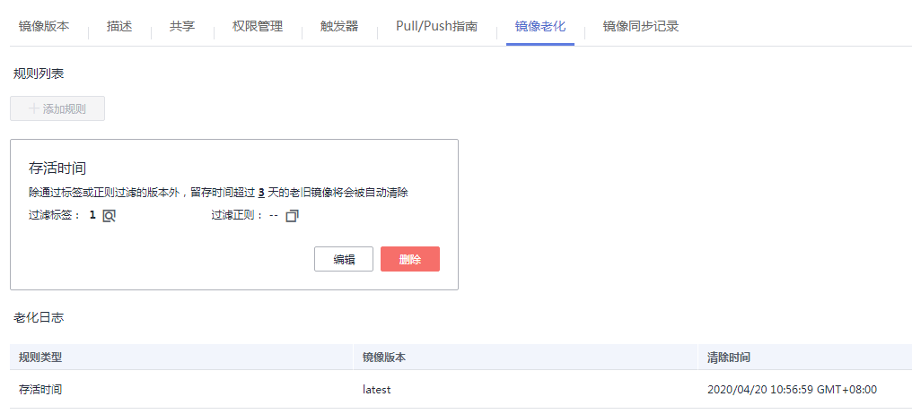
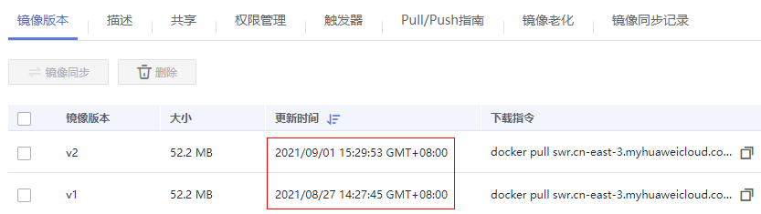
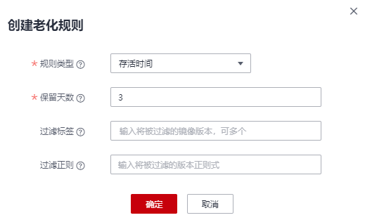
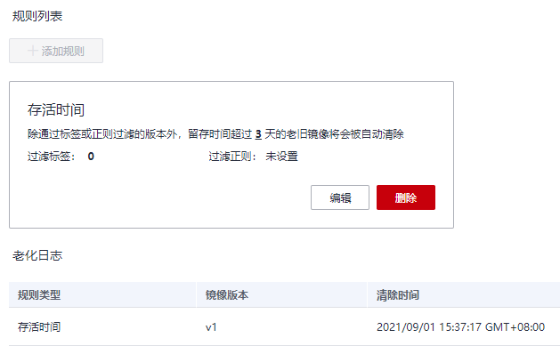
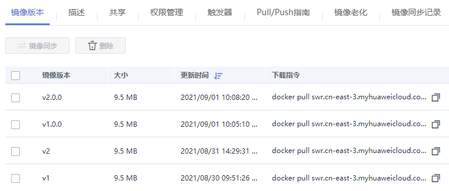
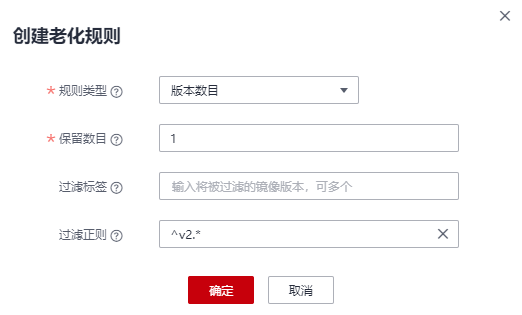

# 添加镜像老化规则

## 操作场景

镜像上传后，您可以添加镜像老化规则。容器镜像服务提供了如下两种类型的镜像老化处理规则，规则设置完成后，系统会根据已定义的规则自动执行镜像老化操作。

-   存活时间：设置该类型的老化规则后，留存时间超过指定时间的老旧镜像将被删除。
-   版本数目：设置该类型的老化规则后，留存镜像超过指定值时，老旧镜像将被删除。

此外，对于特定版本的镜像可通过添加过滤策略来保留，免受老化规则的影响。

## 约束与限制

一个镜像仅支持添加一个老化规则。如需添加新的老化规则，需要删除已有老化规则。

## 操作步骤

1.  登录容器镜像服务控制台。
2.  在左侧导航栏选择“我的镜像“，单击右侧镜像名称，进入镜像详情页。
3.  选择“镜像老化“页签，单击“添加规则“，根据[表1](#table156232449577)填写相关参数，然后单击“确定“。

    **图 1**  创建老化规则  
    

    **表 1**  添加镜像老化规则

|参数|说明|
|--|--|
|规则类型|分为存活时间和版本数目。存活时间：设置该类型的老化规则后，留存时间超过指定时间的老旧镜像将被删除。版本数目：设置该类型的老化规则后，留存镜像超过指定值时，老旧镜像将被删除。|
|保留天数|镜像留存的最大天数，可设置为1~365的整数。规则类型设置为存活时间时，需要配置此参数。|
|保留数目|镜像留存的最大数目，可设置为1~1000的整数。规则类型设置为版本数目时，需要配置此参数。|
|过滤标签|输入将被过滤的镜像版本，在应用老化规则前指定版本的镜像将被过滤掉。|
|过滤正则|输入将被过滤的版本正则式，在应用老化规则前所有版本号满足正则表达式的镜像将被过滤掉。|

    镜像老化规则添加成功后，系统会立即进行一次查询，清理掉符合老化规则的镜像，且在“老化日志“中显示清理结果。

    **图 2**  查看规则列表和老化日志  
    

## 示例1：规则类型为“存活时间“

假设“nginx“镜像包含两个版本：v1和v2，更新时间如下图：

**图 3**  镜像版本  

1.  添加老化规则。

    规则类型为“存活时间“，保留天数为“3“。

    **图 4**  创建老化规则示例  
    

2.  确认规则是否生效。

    查看“老化日志“，v1版本的镜像留存时间超过3天（当前时间为2021/09/01 16:00:00），因此被自动清除。

    **图 5**  老化日志  
    

    查看“镜像版本“，v1版本已被清除，只剩v2版本。

    **图 6**  镜像版本V2  
    

    以上现象说明老化规则已生效。

## 示例2：规则类型为“版本数目“，且设置“过滤正则“

假设“nginx“镜像包含四个版本：v1、v2、v1.0.0、v2.0.0，如下图：

**图 7**  nginx镜像版本  

1.  添加老化规则。

    规则类型为“版本数目“，保留数目为“1“，过滤正则为：^v2.\*（匹配以v2开头的版本号）。

    **图 8**  创建老化规则-版本数目  
    

2.  确认规则是否生效。

    因为v2和v2.0.0版本匹配设置的正则表达式，在应用老化规则前会被过滤掉，v1和v1.0.0版本只会保留一个，v1更老旧，因此会被清除掉。

    查看“老化日志“和“镜像版本“，v1版本被清除，说明老化规则已生效。

    **图 9**  老化日志示例  
    

    **图 10**  镜像版本示例  
    

