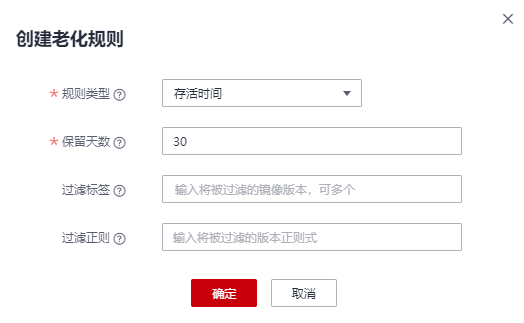
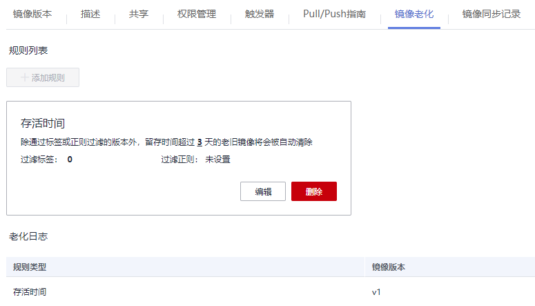

# 添加镜像老化规则

镜像上传后，您可以添加镜像老化规则。容器镜像服务提供了如下两种类型的镜像老化处理规则，规则设置完成后，系统会根据已定义的规则自动执行镜像老化操作。

-   存活时间：设置该类型的老化规则后，将在镜像存留时间超过指定时间时被删除。
-   版本数目：设置该类型的老化规则后，将在版本数超过指定值后删除旧的镜像。

此外，对于特定版本的镜像可通过添加过滤策略来保留，免受老化规则的影响。

## 使用约束

当前仅支持添加1个镜像老化规则。如需添加新的老化规则，需要删除已有老化规则。

## 操作步骤

1.  登录容器镜像服务控制台。
2.  在左侧菜单栏选择“我的镜像“，单击右侧镜像名称，进入镜像详情页。
3.  选择“镜像老化“页签，单击“添加规则“，根据[表1](#table156232449577)填写相关参数，然后单击“确定“。

    **图 1**  创建老化规则  
    

    **表 1**  添加镜像老化规则

    
    <table><thead align="left"><tr id="row362424415719"><th class="cellrowborder" valign="top" width="15.989999999999998%" id="mcps1.2.3.1.1">
参数

    </th>
    <th class="cellrowborder" valign="top" width="84.00999999999999%" id="mcps1.2.3.1.2">
说明

    </th>
    </tr>
    </thead>
    <tbody><tr id="row126241344125712"><td class="cellrowborder" valign="top" width="15.989999999999998%" headers="mcps1.2.3.1.1 ">
规则类型

    </td>
    <td class="cellrowborder" valign="top" width="84.00999999999999%" headers="mcps1.2.3.1.2 ">
规则类型分为存活时间和版本数目。存活时间类型的老化规则将在镜像存留时间超过指定时间时被删除，版本数目类型的老化规则将在版本数超过指定值后删除旧的镜像。此外，对于特定版本的镜像可通过添加过滤策略来保留，免受老化规则的影响。

    </td>
    </tr>
    <tr id="row1462434455710"><td class="cellrowborder" valign="top" width="15.989999999999998%" headers="mcps1.2.3.1.1 ">
保留天数

    </td>
    <td class="cellrowborder" valign="top" width="84.00999999999999%" headers="mcps1.2.3.1.2 ">
镜像留存的最大天数，可设置为1~365的整数。规则类型设置为“存活时间”时，需要配置此参数。

    </td>
    </tr>
    <tr id="row1362494415711"><td class="cellrowborder" valign="top" width="15.989999999999998%" headers="mcps1.2.3.1.1 ">
保留数目

    </td>
    <td class="cellrowborder" valign="top" width="84.00999999999999%" headers="mcps1.2.3.1.2 ">
镜像留存的最大数目，可设置为1~1000的整数。规则类型设置为“版本数目”时，需要配置此参数。

    </td>
    </tr>
    <tr id="row1436518245915"><td class="cellrowborder" valign="top" width="15.989999999999998%" headers="mcps1.2.3.1.1 ">
过滤标签

    </td>
    <td class="cellrowborder" valign="top" width="84.00999999999999%" headers="mcps1.2.3.1.2 ">
输入将被过滤的镜像版本，在应用老化规则前指定版本的镜像将被过滤掉。

    </td>
    </tr>
    <tr id="row2034315951713"><td class="cellrowborder" valign="top" width="15.989999999999998%" headers="mcps1.2.3.1.1 ">
过滤正则

    </td>
    <td class="cellrowborder" valign="top" width="84.00999999999999%" headers="mcps1.2.3.1.2 ">
输入将被过滤的版本正则式，在应用老化规则前所有版本号满足正则表达式的镜像将被过滤掉。

    </td>
    </tr>
    </tbody>
    </table>

4.  镜像老化规则添加成功后，系统会立即进行一次查询，清理掉符合老化规则的镜像，且在“老化日志”中显示清理结果。

    **图 2**  查看规则列表和老化日志  
    

