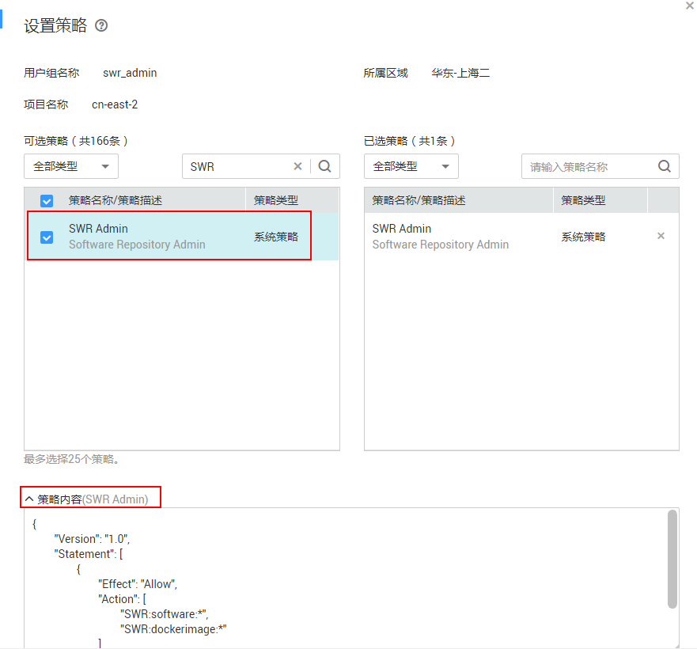

# 策略语法<a name="swr_01_0073"></a>

如下以SWR服务的“SWR Admin”为例，说明策略语法。



```
{
    "Version": "1.0",
    "Statement": [
        {
            "Action": [
                "SWR:software:*",
                "SWR:dockerimage:*"
            ],
            "Effect": "Allow"
        }
    ]
}
```

<a name="table33321739133117"></a>
<table><thead align="left"><tr id="row645212399314"><th class="cellrowborder" colspan="2" valign="top" id="mcps1.1.5.1.1"><p id="p14452153933119"><a name="p14452153933119"></a><a name="p14452153933119"></a>参数</p>
</th>
<th class="cellrowborder" valign="top" id="mcps1.1.5.1.2"><p id="p34521839193112"><a name="p34521839193112"></a><a name="p34521839193112"></a>含义</p>
</th>
<th class="cellrowborder" valign="top" id="mcps1.1.5.1.3"><p id="p20452173933117"><a name="p20452173933117"></a><a name="p20452173933117"></a>值</p>
</th>
</tr>
</thead>
<tbody><tr id="row7452203973118"><td class="cellrowborder" colspan="2" valign="top" headers="mcps1.1.5.1.1 "><p id="p7452163911319"><a name="p7452163911319"></a><a name="p7452163911319"></a>Version</p>
</td>
<td class="cellrowborder" valign="top" headers="mcps1.1.5.1.2 "><p id="p8453193903116"><a name="p8453193903116"></a><a name="p8453193903116"></a>策略的版本</p>
</td>
<td class="cellrowborder" valign="top" headers="mcps1.1.5.1.3 "><p id="p14531039103116"><a name="p14531039103116"></a><a name="p14531039103116"></a>固定为“1.0”</p>
</td>
</tr>
<tr id="row1645315392311"><td class="cellrowborder" rowspan="2" valign="top" width="17.22172217221722%" headers="mcps1.1.5.1.1 "><p id="p5453133973114"><a name="p5453133973114"></a><a name="p5453133973114"></a>Statement</p>
</td>
<td class="cellrowborder" valign="top" width="17.121712171217123%" headers="mcps1.1.5.1.1 "><p id="p94531397312"><a name="p94531397312"></a><a name="p94531397312"></a>Action</p>
</td>
<td class="cellrowborder" valign="top" width="28.28282828282828%" headers="mcps1.1.5.1.2 "><p id="p12453339123116"><a name="p12453339123116"></a><a name="p12453339123116"></a>定义对SWR的具体操作。</p>
</td>
<td class="cellrowborder" valign="top" width="37.37373737373737%" headers="mcps1.1.5.1.3 "><p id="p3453103914318"><a name="p3453103914318"></a><a name="p3453103914318"></a>格式为：服务名:资源类型:操作</p>
<p id="p8453193916312"><a name="p8453193916312"></a><a name="p8453193916312"></a>"SWR:dockerimage:*"，其中SWR为服务名称；“dockerimage” 为资源类型；“*”为通配符，表示对dockerimage资源类型可以执行所有操作。</p>
</td>
</tr>
<tr id="row9453153910318"><td class="cellrowborder" valign="top" headers="mcps1.1.5.1.1 "><p id="p194532391314"><a name="p194532391314"></a><a name="p194532391314"></a>Effect</p>
</td>
<td class="cellrowborder" valign="top" headers="mcps1.1.5.1.1 "><p id="p1945319396315"><a name="p1945319396315"></a><a name="p1945319396315"></a>定义Action中所包含的具体操作是否允许执行。</p>
</td>
<td class="cellrowborder" valign="top" headers="mcps1.1.5.1.2 "><a name="ul14535391313"></a><a name="ul14535391313"></a><ul id="ul14535391313"><li>Allow：允许执行。</li><li>Deny：不允许执行。</li></ul>
</td>
</tr>
</tbody>
</table>

