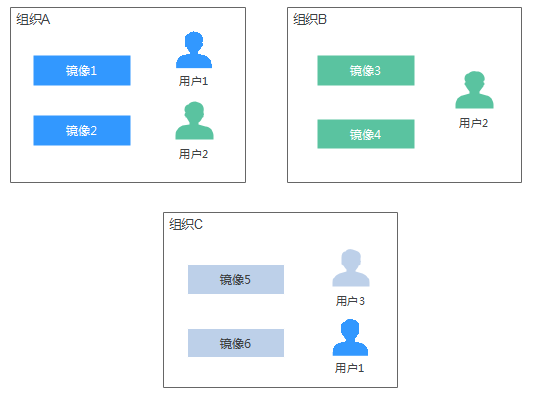
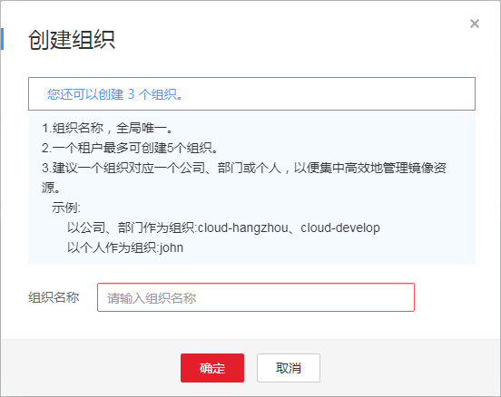
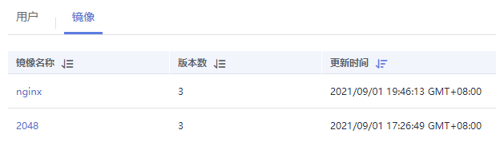

# 组织管理

组织用于隔离镜像仓库，每个组织可对应一个公司或部门，将其拥有的镜像集中在该组织下。在不同的组织下，可以有同名的镜像。同一IAM用户可属于不同的组织。SWR支持为账户下IAM用户分配相应的访问权限（读取、编辑、管理），具体请参见[授权管理](授权管理.md)。

**图 1**  组织  

## 创建组织

容器镜像服务为您提供组织管理功能，方便您根据自身组织架构来构建镜像的资源管理。上传镜像前，请先创建组织。

1.  登录容器镜像服务控制台。
2.  在左侧菜单栏选择“组织管理“，单击右侧“创建组织“，在弹出的页面中填写“组织名称“，然后单击“确定“。

    **图 2**  创建组织  
    

## 查看组织中的镜像

创建组织后，您可以查看当前组织中的镜像。

1.  登录容器镜像服务控制台。
2.  在左侧菜单栏选择“组织管理“，单击右侧组织名称。
3.  单击“镜像“页签，查看当前组织中的镜像。

    **图 3**  查看组织中的镜像  
    

