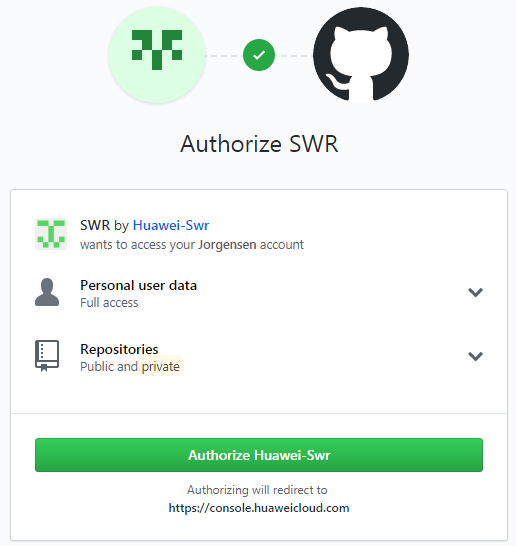
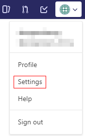
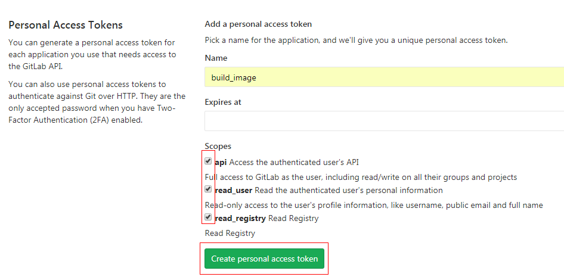
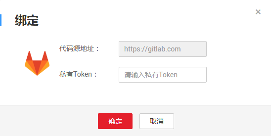
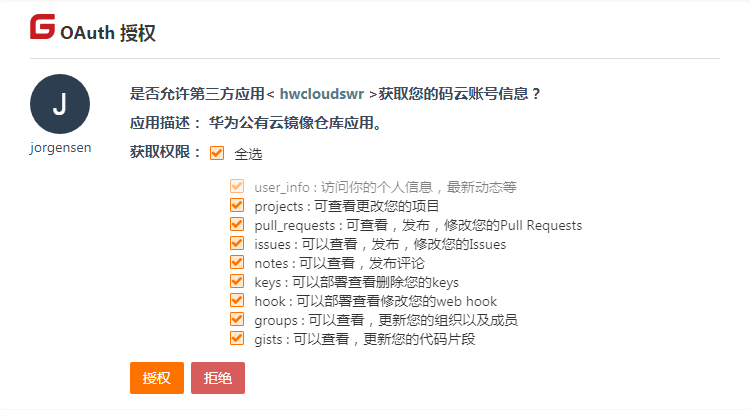

# 绑定源码仓库账号

容器镜像服务支持对接Github等源码托管网站构建镜像，当代码更新时自动触发镜像构建。

构建镜像前，您需要绑定源码托管仓库的账号，授权容器镜像服务下载源代码。当前容器镜像服务支持GitHub、GitLab、Gitee。

## 绑定GitHub帐号

1.  登录容器镜像服务控制台。
2.  在左侧菜单栏选择“镜像构建  \>  源码托管“。
3.  在GitHub所在行，单击“绑定“。
4.  登录GitHub。
5.  单击“Authorize Huawei-Swr“，完成绑定。

    **图 1**  绑定GitHub帐号  
    

## 绑定GitLab账号

1.  获取GitLab Access Token。
    1.  登录GitLab。
    2.  单击右上角图标，选择  “settings“。

        **图 2**  选择Settings  
        

    3.  在左侧菜单栏选择“Access Tokens“，填写名称，勾选“read\_registry“选项，单击“Create personal access token“，创建token。

        **图 3**  创建token  
        

    4.  复制并保存token。

2.  登录容器镜像服务控制台。
3.  在左侧菜单栏选择“镜像构建 \> 源码托管“。
4.  在GitLab所在行，单击“绑定“，输入[1](#li850713212018)获取的token并单击“确定“。

    **图 4** 绑定GitLab帐号  
    

## 绑定Gitee账号

1.  登录容器镜像服务控制台。
2.  在左侧菜单栏选择“镜像构建 \>  源码托管“。
3.  在Gitee所在行，单击“绑定“。
4.  登录Gitee。
5.  单击“授权“，完成绑定。

    **图 5** 绑定Gitee账号  
    

