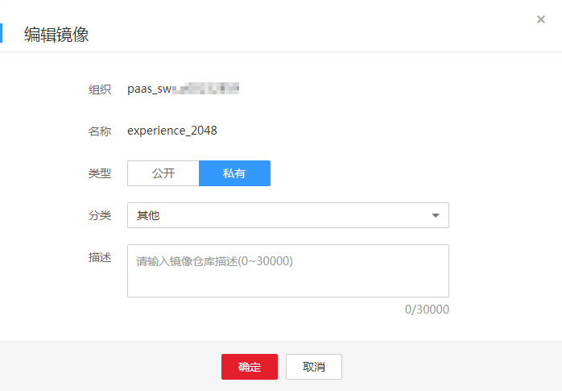

# 编辑镜像属性

镜像上传后，您可以设置镜像的属性，包括镜像的类型（“公开”或“私有”）、分类及描述。

公开镜像所有用户都能下载，私有镜像则受具体权限管理控制。您可以为用户添加授权，授权完成后，用户享有读取、编辑或管理私有镜像的权限，具体请参见[在镜像详情中添加授权](授权管理.md#section851514354541)。

## 操作步骤

1.  登录容器镜像服务控制台。
2.  在左侧菜单栏选择“我的镜像“，单击右侧要编辑镜像的名称。
3.  在镜像详情页面，单击右上角“编辑”，根据需要在弹出的窗口中编辑类型（“公开”或“私有”）、分类及描述，然后单击“确定“。

    **图 1**  编辑镜像属性  
    

    **表 1**  编辑镜像

    
    <table><thead align="left"><tr id="row362424415719"><th class="cellrowborder" valign="top" width="16%" id="mcps1.2.3.1.1">
参数

    </th>
    <th class="cellrowborder" valign="top" width="84%" id="mcps1.2.3.1.2">
说明

    </th>
    </tr>
    </thead>
    <tbody><tr id="row126241344125712"><td class="cellrowborder" valign="top" width="16%" headers="mcps1.2.3.1.1 ">
组织

    </td>
    <td class="cellrowborder" valign="top" width="84%" headers="mcps1.2.3.1.2 ">
镜像所属组织。

    </td>
    </tr>
    <tr id="row1462434455710"><td class="cellrowborder" valign="top" width="16%" headers="mcps1.2.3.1.1 ">
名称

    </td>
    <td class="cellrowborder" valign="top" width="84%" headers="mcps1.2.3.1.2 ">
镜像名称。

    </td>
    </tr>
    <tr id="row1362494415711"><td class="cellrowborder" valign="top" width="16%" headers="mcps1.2.3.1.1 ">
类型

    </td>
    <td class="cellrowborder" valign="top" width="84%" headers="mcps1.2.3.1.2 ">
镜像类型，可选择：

    <ul id="ul14883318487"><li>公开</li><li>私有</li></ul>
    </td>
    </tr>
    <tr id="row2034315951713"><td class="cellrowborder" valign="top" width="16%" headers="mcps1.2.3.1.1 ">
分类

    </td>
    <td class="cellrowborder" valign="top" width="84%" headers="mcps1.2.3.1.2 ">
镜像分类，可选择：

    <ul id="ul295090202015"><li>应用服务器</li><li>Linux</li><li>Windows</li><li>Arm</li><li>框架与应用</li><li>数据库</li><li>语言</li><li>其他</li></ul>
    </td>
    </tr>
    <tr id="row1867154816580"><td class="cellrowborder" valign="top" width="16%" headers="mcps1.2.3.1.1 ">
描述

    </td>
    <td class="cellrowborder" valign="top" width="84%" headers="mcps1.2.3.1.2 ">
输入镜像仓库描述，0-30000个字符。

    </td>
    </tr>
    </tbody>
    </table>

