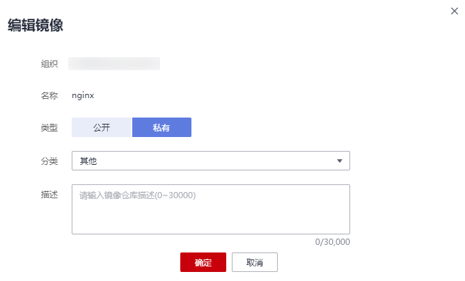

# 编辑镜像属性

## 操作场景

镜像上传后默认为私有镜像，您可以设置镜像的属性，包括镜像的类型（“公开”或“私有”）、分类及描述。

公开镜像所有用户都能下载，私有镜像则受具体权限管理控制。您可以为用户添加授权，授权完成后，用户享有读取、编辑或管理私有镜像的权限，具体请参见[在镜像详情中添加授权](授权管理.md#section851514354541)。

## 操作步骤

1.  登录容器镜像服务控制台。
2.  在左侧菜单栏选择“我的镜像“，单击右侧要编辑镜像的名称。
3.  在镜像详情页面，单击右上角“编辑“，在弹出的窗口中根据需要编辑类型（“公开”或“私有”）、分类及描述，然后单击“确定“。

    **图 1**  编辑镜像属性  
    

    **表 1**  编辑镜像

|参数|说明|
|--|--|
|组织|镜像所属组织。|
|名称|镜像名称。|
|类型|镜像类型，可选择：公开私有公开镜像所有用户都可以下载使用。如果您的机器与镜像仓库在同一区域，访问仓库是通过内网访问。如果您的机器与镜像仓库在不同区域，通过公网才能访问仓库，下载跨区域仓库的镜像需要机器可以访问公网。|
|分类|镜像分类，可选择：应用服务器LinuxWindowsArm框架与应用数据库语言其他|
|描述|输入镜像仓库描述，0-30000个字符。|

