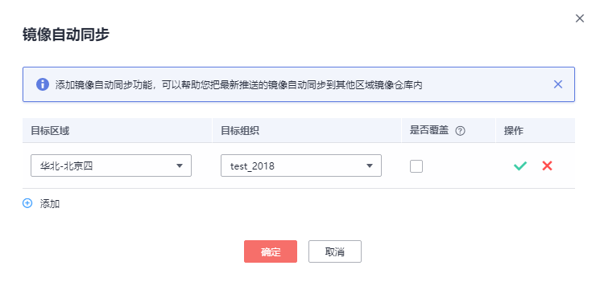

# 自动同步镜像

镜像上传后，您可以添加镜像自动同步功能，帮助您把最新推送的镜像自动同步到其他区域镜像仓库内。

> **说明：**   
>镜像自动同步帮助您把最新推送的镜像自动同步到其他区域镜像仓库内，后期镜像有更新时，目标仓库的镜像也会自动更新，但已有的镜像不会自动同步。  
>已有镜像的同步方法请参见[为什么已有镜像自动同步不成功？](https://support.huaweicloud.com/swr_faq/swr_faq_0022.html)。  

## 使用约束

仅账号及具有管理员权限的用户才能使用镜像自动同步功能。

目前仅支持“华北-北京一”、“华北-北京四”、“华东-上海一”、“华东-上海二”、“华南-广州”、“亚太-香港”、“亚太-新加坡”区域。

## 操作步骤

1.  登录容器镜像服务控制台。
2.  在左侧菜单栏选择“我的镜像“，单击右侧镜像名称。
3.  在镜像详情页面单击右上角“自动同步镜像“，添加镜像同步的目标区域和目标组织，添加完成后单击“确定”。

    **图 1**  添加镜像自动同步  
    

    -   目标区域：选择同步的目标区域，例如“华南-广州”。
    -   目标组织：选择同步的目标组织。
    -   是否覆盖：勾选则表示覆盖，同步相同名称的镜像时，同步后会替换已有的镜像。不勾选则表示不覆盖，同步相同名称的镜像时，会取消同步并提示已存在相同名称镜像。

1.  在镜像详情页面的“镜像同步记录“页签下，可查看镜像同步启动时间、镜像版本、状态、同步类型、同步耗时、目标区域、目标组织、同步者等。

