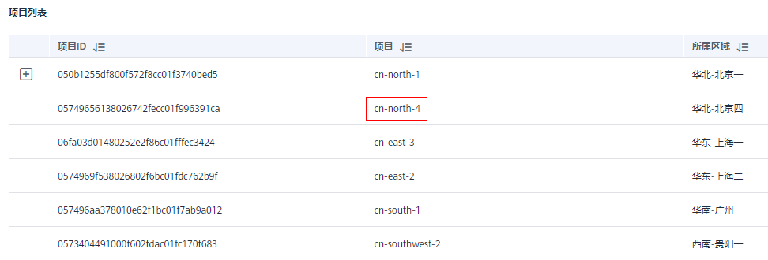

# 获取长期有效docker login指令<a name="swr_01_1000"></a>

本节介绍如何获取长期有效的docker login指令。

## 操作步骤<a name="section140815918599"></a>

1.  <a name="li5768123671815"></a>获取镜像仓库访问地址、区域项目名称。
    1.  访问我的凭证[https://console.huaweicloud.com/iam/\#/myCredential](https://console.huaweicloud.com/iam/#/myCredential)。
    2.  在“项目列表”页签中查找当前区域对应的项目。

        如下图所示，“中国华北区1“对应的项目为“cn-north-1“。

        **图 1**  区域与项目<a name="fig1548146070"></a>  
        

        镜像仓库地址为 : swr.区域项目名称.myhuaweicloud.com，如中国华北区1对应的镜像仓库地址为swr.cn-north-1.myhuaweicloud.com。


2.  <a name="li1863783911295"></a>获取AK/SK访问密钥。

    > **说明：**   
    >如果已有AK/SK，可以直接使用，无需再次获取。  

    1.  访问我的凭证[https://console.huaweicloud.com/iam/\#/myCredential](https://console.huaweicloud.com/iam/#/myCredential)。
    2.  在“管理访问密钥”页签，单击列表下侧的“新增访问密钥”，创建新的访问密钥。

        **图 2**  新增访问密钥<a name="fig1750516234350"></a>  
        

    3.  输入当前用户的登录密码，并通过邮箱或者手机进行验证。

        > **说明：**   
        >在统一身份认证服务中创建的用户，如果创建时未填写邮箱或者手机号，则只需校验登录密码。  

    4.  单击“确定”，下载访问密钥。

        请妥善保存已下载的密钥，后续创建集群时需要上传该密钥，否则会无法创建集群。

        > **说明：**   
        >为防止访问密钥泄露，建议您将其保存到安全的位置。  


3.  <a name="li132430753010"></a>登录一台linux系统的计算机，执行如下命令获取登录密钥。

    printf "_$AK_" | openssl dgst -binary -sha256 -hmac "_$SK_" | od -An -vtx1 | sed 's/\[ \\n\]//g' | sed 'N;s/\\n//'

    其中$AK和$SK为[2](#li1863783911295)获取的AK/SK。

    **图 3**  示例<a name="fig56444333813"></a>  
    

4.  使用如下的格式拼接docker login指令。

    docker login -u  \[区域项目名\]@\[AK\]  -p  \[登录密钥\]  \[镜像仓库地址\]

    其中，区域项目名和镜像仓库地址在[1](#li5768123671815)中获取，AK在[2](#li1863783911295)中获取，登录密钥为[3](#li132430753010)的执行结果。

    示例如下：

    ```
    docker login -u cn-north-1@DKAKX9J6OBEVMARHLBQM -p 7ca3582173f52caa98fcf87389e9cc26d007a2e4b2f6231006a301568f2e1ef8 swr.cn-north-1.myhuaweicloud.com
    ```


