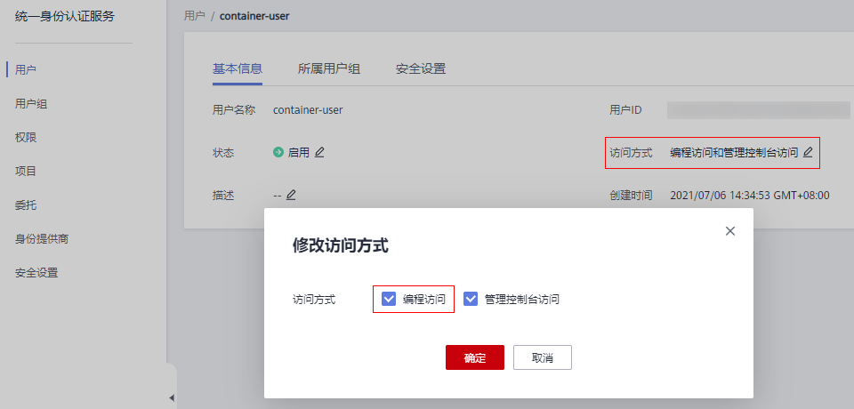
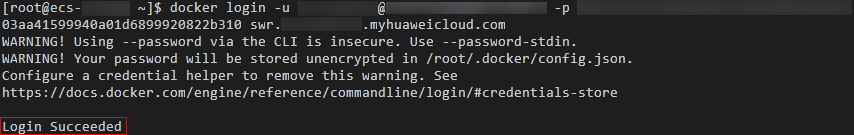

# 获取长期有效登录指令

## 操作场景

本章节介绍如何获取长期有效的登录指令，长期有效登录指令的有效期为永久。

> **说明：** 
>为保证安全，获取登录指令过程建议在开发环境执行。

## 前提条件

用户需要有编程访问权限，如果无编程访问权限，需要使用管理员帐号登录IAM，修改用户访问方式。

**图 1**  修改访问方式  

## 操作步骤

1.  获取区域项目名称、镜像仓库地址。
    1.  登录管理控制台，单击右上角您的用户名处，单击“我的凭证“。
    2.  在“API凭证”的项目列表中查找当前区域对应的项目。

        如下图所示，“华北-北京四“对应的项目名称为“cn-north-4“。

        **图 2**  区域与项目  
        

    3.  镜像仓库地址为 : swr.区域项目名称.myhuaweicloud.com，如华北-北京四对应的镜像仓库地址为：swr.cn-north-4.myhuaweicloud.com。

2.  获取AK/SK访问密钥。

    > **说明：** 
    >访问密钥即AK/SK（Access Key ID/Secret Access Key），表示一组密钥对，用于验证调用API发起请求的访问者身份，与密码的功能相似。如果您已有AK/SK，可以直接使用，无需再次获取。

    1.  登录管理控制台，单击右上角您的用户名处，单击“我的凭证“。
    2.  在左侧导航栏中选择“访问密钥“，单击“新增访问密钥“。
    3.  输入描述信息，单击“确定“。
    4.  在弹出的提示页面单击“立即下载“。

        下载成功后，在“credentials“文件中即可获取AK和SK信息。

        > **说明：** 
        >为防止访问密钥泄露，建议您将其保存到安全的位置。

3.  登录一台linux系统的计算机，执行如下命令获取登录密钥。

    **printf "_$AK_" | openssl dgst -binary -sha256 -hmac "_$SK_" | od -An -vtx1 | sed 's/\[ \\n\]//g' | sed 'N;s/\\n//'**

    其中$AK和$SK为[2](#li1863783911295)获取的AK/SK。

    **图 3**  示例  
    

4.  使用如下的格式拼接登录指令。

    **docker login -u**  \[区域项目名\]**@**\[AK\]  **-p**  \[登录密钥\] \[镜像仓库地址\]

    其中，区域项目名和镜像仓库地址在[1](#li5768123671815)中获取，AK在[2](#li1863783911295)中获取，登录密钥为[3](#li132430753010)的执行结果。

    示例：

    **docker login -u cn-north-4@**_CCXXXXX_ **-p** _96xxxxx_ **swr.cn-north-4.myhuaweicloud.com**

    **图 4**  使用长期登录指令连接SWR  
    

    > **说明：** 
    >-   登录密钥字符串是经过加密的，无法逆向解密，从-p无法获取到SK。
    >-   获取的登录指令可在其他机器上使用并登录。

5.  使用**history -c**命令清理相关使用痕迹，避免隐私信息泄露。

