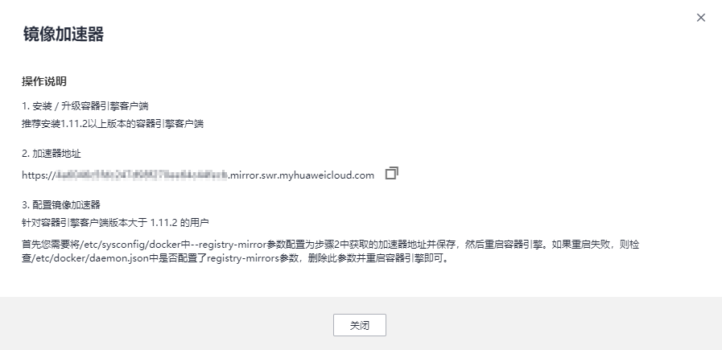

# 设置镜像加速器

容器镜像服务为您提供镜像加速功能，您可以通过修改daemon配置文件/etc/docker/daemon.json来使用加速器。

> **须知：**   
>-   当前仅支持海外Docker Hub的镜像源加速服务。  
>-   Docker客户端版本必须为1.11.2及以上。  

## 操作步骤

1.  登录容器镜像服务控制台。
2.  在左侧菜单栏选择“镜像资源\>镜像中心“。
3.  在右侧单击“镜像加速器”，在弹出的对话框中获取镜像加速器地址和配置镜像加速器的方法，如[图1](#fig16999410123112)。

    **图 1**  镜像加速器  
    

