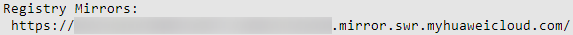

# 设置镜像加速器<a name="swr_01_0045"></a>

## 操作场景<a name="section182635264537"></a>

通过docker pull命令下载镜像中心的公有镜像时，往往会因为网络原因而需要很长时间，甚至可能因超时而下载失败。为此，容器镜像服务提供了镜像下载加速功能，帮助您获得更快的下载体验。

## 约束与限制<a name="section16241911484"></a>

-   构建镜像的客户端所安装的容器引擎（Docker）版本必须为1.11.2及以上。
-   “华北-乌兰察布一”、“亚太-雅加达”、“拉美-墨西哥城一”、“拉美-墨西哥城二”和“拉美-圣保罗一”区域不支持该功能，如需使用，请切换到其他区域。

## 操作步骤<a name="zh-cn_topic_0083050725_section283714373385"></a>

1.  登录容器镜像服务控制台。
2.  在左侧导航栏选择“镜像资源 \> 镜像中心“。

    > **说明：** 
    >在使用镜像中心功能前，请确保您的当前区域支持镜像中心功能，详情请见[镜像中心约束与限制](镜像中心.md#section04904598291)。

3.  <a name="li446945312"></a>单击“镜像加速器“，在弹框中找到“加速器地址”，单击，将加速器地址复制到剪切板。

    **图 1**  镜像加速器地址<a name="fig16999410123112"></a>  
    

4.  以root用户登录容器引擎所在的虚拟机。
5.  修改“/etc/docker/daemon.json“文件（如果没有，可以手动创建），在该文件内添加如下内容：

    **vi /etc/docker/daemon.json**

    ```
    {
        "registry-mirrors": ["加速器地址"]
    }
    ```

    其中，加速器地址请替换为[3](#li446945312)中获取的镜像加速器地址。

    按“Esc“，输入**:wq**保存并退出。

6.  配置完成后，执行**systemctl restart docker**重启容器引擎。

    如果重启失败，则检查操作系统其他位置（如：/etc/sysconfig/docker、/etc/default/docker）是否配置了registry-mirrors参数，删除此参数并重启容器引擎即可。

7.  执行**docker info**，当Registry Mirrors字段的地址为加速器的地址时，说明加速器已经配置成功。

    **图 2**  Registry Mirrors信息<a name="fig1460273215229"></a>  
    


