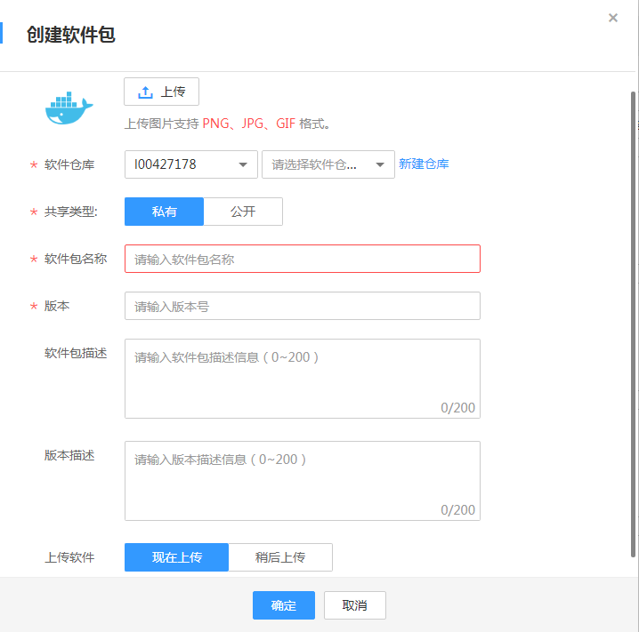
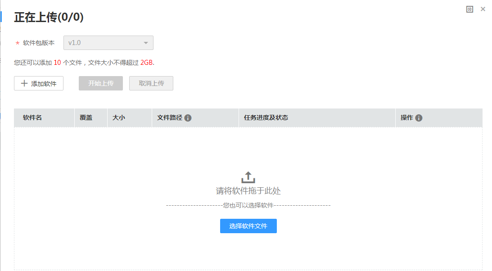

# 软件中心

您可以在此处创建软件包并查看已有的软件包。如果软件包较多，您可以通过搜索功能查找目标软件包。

1.  登录容器镜像服务控制台。
2.  在左侧菜单栏选择“软件中心”，单击右侧“创建软件包”。
3.  根据页面提示，配置如下[表1](#table53885404413)信息。

    **图 1**  创建软件包  
    

    **表 1**  创建软件包

    
    <table><thead align="left"><tr id="row1838717424415"><th class="cellrowborder" valign="top" width="24.46%" id="mcps1.2.3.1.1">
参数名称

    </th>
    <th class="cellrowborder" valign="top" width="75.53999999999999%" id="mcps1.2.3.1.2">
配置说明

    </th>
    </tr>
    </thead>
    <tbody><tr id="row338854124418"><td class="cellrowborder" valign="top" width="24.46%" headers="mcps1.2.3.1.1 ">
上传

    </td>
    <td class="cellrowborder" valign="top" width="75.53999999999999%" headers="mcps1.2.3.1.2 ">
上传软件包的图片，支持PNG、JPG、GIF格式的图片，可保持默认。

    </td>
    </tr>
    <tr id="row73881247444"><td class="cellrowborder" valign="top" width="24.46%" headers="mcps1.2.3.1.1 ">
*软件仓库

    </td>
    <td class="cellrowborder" valign="top" width="75.53999999999999%" headers="mcps1.2.3.1.2 ">
选择软件仓库地址，若无可用的软件仓库，可单击“新建仓库”创建软件仓库。

    </td>
    </tr>
    <tr id="row1838811454417"><td class="cellrowborder" valign="top" width="24.46%" headers="mcps1.2.3.1.1 ">
*共享类型

    </td>
    <td class="cellrowborder" valign="top" width="75.53999999999999%" headers="mcps1.2.3.1.2 ">
提供2中共享类型：

    <ul id="ul10388948444"><li>私有</li><li>公开</li></ul>
    </td>
    </tr>
    <tr id="row1738819454417"><td class="cellrowborder" valign="top" width="24.46%" headers="mcps1.2.3.1.1 ">
*软件包名称

    </td>
    <td class="cellrowborder" valign="top" width="75.53999999999999%" headers="mcps1.2.3.1.2 ">
配置为软件包名称。

    </td>
    </tr>
    <tr id="row153881248441"><td class="cellrowborder" valign="top" width="24.46%" headers="mcps1.2.3.1.1 ">
*版本

    </td>
    <td class="cellrowborder" valign="top" width="75.53999999999999%" headers="mcps1.2.3.1.2 ">
配置软件包的版本。

    </td>
    </tr>
    <tr id="row1138874104416"><td class="cellrowborder" valign="top" width="24.46%" headers="mcps1.2.3.1.1 ">
软件包描述

    </td>
    <td class="cellrowborder" valign="top" width="75.53999999999999%" headers="mcps1.2.3.1.2 ">
软件包的描述信息。

    </td>
    </tr>
    <tr id="row53885474418"><td class="cellrowborder" valign="top" width="24.46%" headers="mcps1.2.3.1.1 ">
版本描述

    </td>
    <td class="cellrowborder" valign="top" width="75.53999999999999%" headers="mcps1.2.3.1.2 ">
版本描述信息。

    </td>
    </tr>
    <tr id="row153881848449"><td class="cellrowborder" valign="top" width="24.46%" headers="mcps1.2.3.1.1 ">
上传软件

    </td>
    <td class="cellrowborder" valign="top" width="75.53999999999999%" headers="mcps1.2.3.1.2 ">
提供2种方式：

    <ul id="ul1138819414449"><li>现在上传</li><li>稍后上传</li></ul>
    </td>
    </tr>
    </tbody>
    </table>

4.  单击“确定”。
5.  （可选）上传软件包，如[图2](#fig1491910124464)所示。

    > **说明：**   
    >若“上传软件”配置为“现在上传”，则需要执行此步骤。  

    **图 2**  上传软件包  
    

6.  单击“添加软件”，选择软件包，单击“开始上传”。
7.  上传完成后，显示“上传成功”。

