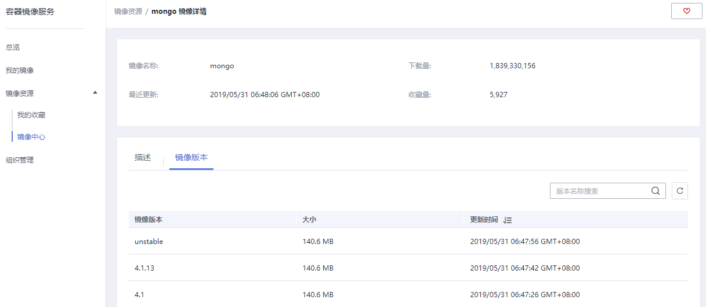

# 镜像中心

## 操作场景

容器镜像服务为您提供大量的公有镜像资源检索，您可以收藏这些镜像并推送到自己的仓库中，方便使用。

## 约束与限制

“华北-乌兰察布一”、“亚太-雅加达”、“拉美-墨西哥城一”、“拉美-墨西哥城二”和“拉美-圣保罗一”区域暂不支持“镜像中心”功能，如需使用，请切换到其他区域。

## 收藏镜像

1.  登录容器镜像服务控制台。
2.  在左侧菜单栏选择“镜像资源 \> 镜像中心“。
3.  在镜像列表中，选择待收藏镜像，单击右侧图标。

    镜像收藏成功后，您可以在“我的收藏“页面查看。

## 下载镜像中心的镜像

镜像中心的镜像可直接下载，无需添加仓库地址。如[图1](#fig2889193517333)所示的mongo镜像，只需容器引擎所在虚拟机连接SWR，且执行如下命令即可将其下载。

**docker pull mongo:**_4.1_

**图 1**  mongo镜像详情示例  

详细镜像下载步骤，请参考[下载镜像](下载镜像.md)。

