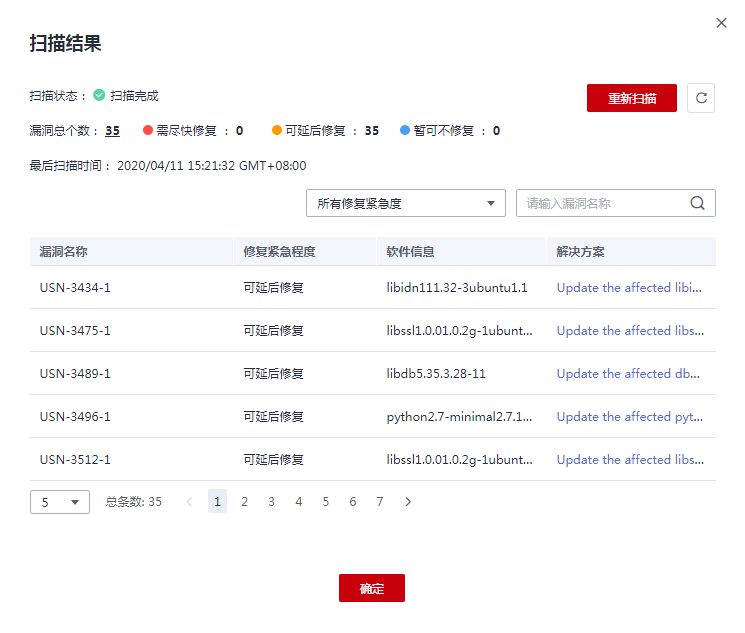

# 镜像安全扫描

## 操作场景

容器镜像服务为您提供了镜像安全扫描的功能，您只需要一键就可以对您的镜像进行安全扫描。容器镜像服务可扫描镜像仓库中的私有镜像，发现镜像中的漏洞并给出修复建议，帮助您得到一个安全的镜像。

## 约束与限制

目前仅支持“华北-北京一”、“华北-北京四”区域。

## 操作步骤

1.  登录容器镜像服务控制台。
2.  在左侧导航栏选择“我的镜像“，单击右侧镜像名称，进入镜像详情页。
3.  在“镜像版本“页签，选择待操作的镜像版本并单击右侧的“镜像扫描“。
4.  单击“重新扫描“，触发镜像的安全扫描，稍等片刻将展示镜像的漏洞扫描结果。

    **图 1**  镜像安全扫描结果  
    

    -   漏洞名称：显示该镜像上扫描出的漏洞名称。
    -   修复紧急程度：提示您是否需要立刻处理该漏洞。
    -   软件信息：显示该镜像上受此漏洞影响的软件及版本信息。
    -   解决方案：针对该漏洞给出的解决方案。单击“解决方案“列的链接，查看修复意见。

